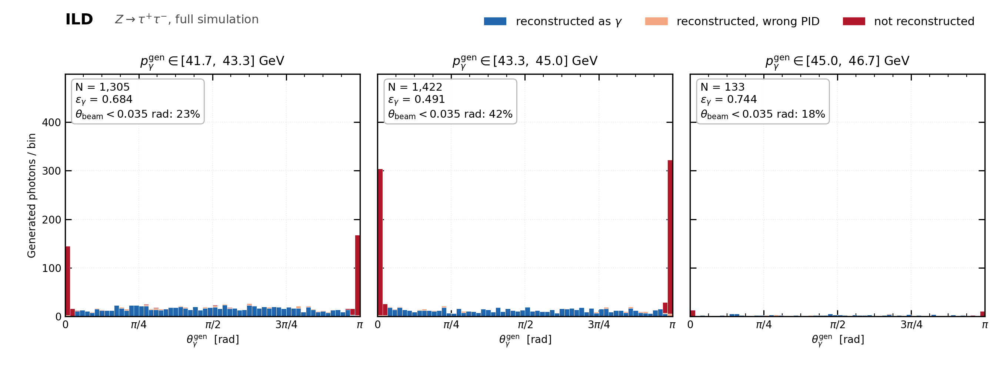
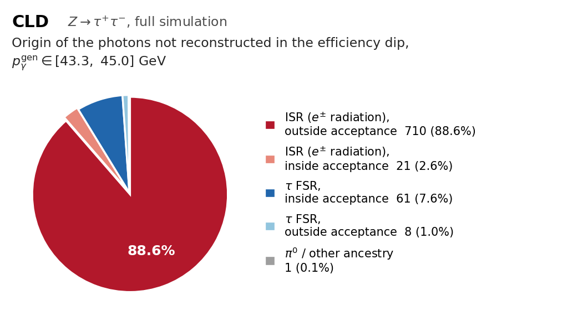

# The photon efficiency dip at 43.3–45.0 GeV

The photon efficiency as a function of the generated momentum drops sharply in the
next-to-last populated bin, 43.3–45.0 GeV, and recovers in the last one. It is not a
detector effect: it is sample composition.

## 1. Where the photons are (`plot_polar_dip.py`)



Polar-angle spectrum of the generated photons in the dip bin and its two neighbours,
split by reconstruction outcome. Input is the particle-level association parquet
(dR matching) from `HitAnalysis/particle_level_analisis_parallel.py`.

```bash
python docs/photon_isr_45GeV/plot_polar_dip.py \
    -i Results/TauReco/ILD_FCC_2M_dedupreco_results0.4_tph0.0_tpi0.0_n0.0_g0.0/association_results_full_dR.parquet \
    -d ILD -o docs/photon_isr_45GeV
```

In the dip bin 42 % of the photons sit at `θ_beam < 0.035` rad, piled up in the two
spikes at `θ ≈ 0` and `θ ≈ π`, and none of them is reconstructed.

## 2. What those photons are (`plot_lost_photon_origin.py`)



Generator ancestry (`GenPhotonOrigin` / `GenPhotonParentPDG` of the tau tree) of the
photons of the dip bin with no reconstructed counterpart. A photon counts as
reconstructed when some photon PFO points back to it through `RecoPhotonGenMatchIdx`
(the `RecoMCTruthLink` association), which is a different matching from the dR one used
in section 1 — the two agree closely here (N = 1 444 vs 1 422, ε = 0.445 vs 0.491).

```bash
python docs/photon_isr_45GeV/plot_lost_photon_origin.py \
    -i Results/TauReco/New2MSample_smearing_results0.4_tph0.0_tpi0.0_n0.0_g0.0/Tree_resultsdecayAll_0.4_tph0.0_tpi0.0_n0.0_g0.0.root \
    -d CLD -o docs/photon_isr_45GeV
```

Sample `ztt_2M_smearing` (CLD full sim, 2 M events), 1 444 generated photons in the bin,
ε_γ = 0.445, 801 of them lost:

| origin | N | % |
|---|---|---|
| ISR (radiated by an e±), outside acceptance | 710 | 88.6 |
| ISR (radiated by an e±), inside acceptance | 21 | 2.6 |
| τ FSR, inside acceptance | 61 | 7.6 |
| τ FSR, outside acceptance | 8 | 1.0 |
| π0 / other ancestry | 1 | 0.1 |

**94 % of the losses are ISR photons, and 90 % of all losses are simply outside the
acceptance.** The acceptance boundary is measured from the data, not assumed: the
reconstruction efficiency of the ISR photons of this bin is exactly 0 for
`θ_beam < 0.141` rad (|cos θ| > 0.99) and 0.86–0.89 above it, with no transition bin.

| `θ_beam` (rad) | N (ISR) | ε |
|---|---|---|
| 0.000–0.010 | 26 | 0.038 |
| 0.010–0.035 | 578 | 0.000 |
| 0.035–0.080 | 66 | 0.000 |
| 0.080–0.141 | 41 | 0.000 |
| 0.141–0.300 | 63 | 0.857 |
| 0.300–π/2 | 112 | 0.893 |

The τ FSR photons behave the same way (ε = 0 below 0.141 rad, 0.84–0.89 above), so the
residual 7.6 % is the ordinary ~12 % inefficiency of a photon inside the detector, not a
feature of the bin.

## Why the bin is special

At `√s = m_Z` a hard ISR photon can only take the event away from the Z pole, so the ISR
spectrum is pushed towards the largest momenta a single photon can carry, and it is
beam-collinear by construction. The 43.3–45.0 GeV bin is where that population peaks
relative to the flat tau-decay photons, so the mixture is dominated by photons that go
down the beam pipe. The last bin (45.0–46.7 GeV) sits above the kinematic reach of most
of that ISR and the efficiency recovers. Nothing about the detector changes across the
dip: restricted to `θ_beam > 0.141` rad the efficiency is flat across the four bins
above 40 GeV — 0.858 / 0.871 / 0.886 / 0.885 for 40.0–41.7, 41.7–43.3, 43.3–45.0 and
45.0–46.7 GeV.
