# El fotón extra en τ→πν: origen y discriminación

Muestra `ztt_2M` (CLD full sim, 2 M eventos), tree
`Results/TauReco/New2MSample_results0.4_tph0.0_tpi0.0_n0.0_g0.0/Tree_resultsdecayAll_0.4_tph0.0_tpi0.0_n0.0_g0.0.root`
(cono dR<0.4, sin corte en P de fotones ni pión). Verificación independiente sobre 25 ficheros
EDM4hep originales (25 000 eventos) con podio. Scripts en `scripts/`, figuras en `figs/`.

## Resumen ejecutivo

1. **La caída de eficiencia de τ→πν está en el P total del tau, no en el visible.** Frente a
   `GenVisTauP` la migración π→π+γ es un 4-5 % casi plano. Frente a `GenTauP` sube al
   **25-34 % entre 20 y 40 GeV** (y al 14-20 % por debajo de 20 GeV). Un tau con P total muy por
   debajo de E_haz = 45.6 GeV es, casi por definición, un tau que ha radiado.
2. **El fotón extra es real en el 55 % de los casos y es FSR de la línea del tau** (Z→ττγ en el
   shower QED de Pythia: el fotón cuelga de una copia del tau con status 23/51/52, no del tau
   status 2, así que la clasificación gen no lo ve y etiqueta el tau como tipo 0). Su momento
   es **P_γ ≈ E_haz − P_τ**: en la ventana 20-40 GeV de `GenTauP` es un fotón de 8-28 GeV y
   explica el 88-91 % de la migración. El otro 43 % global es un **fragmento del shower
   hadrónico del pión** (cluster ECAL blando, 0.5 GeV, pegado al pión) y el 3 % ISR blando.
   No hay π0 del otro tau, ni radiación del pión en el generador, ni ISR duro.
3. **No es contaminación de otra categoría**: es (a) física real del propio tau mal etiquetada
   en gen y (b) un artefacto de clustering. Nada de esto se arregla con un corte fijo en P de
   los fotones sin destrozar π π0 / π 2π0 (P<1 GeV: −0.06 en gen 2 y −0.16 en gen 3).
4. **Criterio recomendado (nivel reco, por fotón del cono, sólo 1-prong):** rechazar el fotón
   si **no tiene pareja π0** (ningún otro fotón del cono con |m_γγ − 0.135| < 0.05 GeV) **y**
   (**P_γ/P_π < 0.05** o (**P_γ > 2 GeV y m(π+γ) > 1.2 GeV**)). Resultado sobre el fichero
   completo:

   | eficiencia gen X → DM X | baseline | recomendado | Δ |
   |---|---|---|---|
   | gen 0 → DM 0, global | 0.707 | 0.733 | +0.027 |
   | gen 0 → DM 0, `GenTauP` 20-40 | 0.478 | 0.655 | **+0.176** |
   | gen 1 → DM 1, global | 0.640 | 0.640 | 0.000 |
   | gen 1 → DM 1, `GenTauP` 20-40 | 0.460 | 0.550 | +0.090 |
   | gen 2 → DM 2, global | 0.563 | 0.561 | −0.002 |
   | gen 3 → DM 3, global (sólo parte blanda) | 0.477 | 0.475 | −0.003 |
   | gen 10 → DM 10, global (sólo parte blanda) | 0.454 | 0.471 | +0.017 |
   | e → DM 0, μ → DM 0 | 0.017 / 0.073 | 0.018-0.021 / 0.075 | ≈0 |

   El rechazo con m(π+γ) también mejora π π0 y π 2π0 en la misma ventana, porque el mismo FSR
   les empujaba un DM hacia arriba.
5. **A nivel gen** conviene además contar el FSR de la línea del tau (GenPhotonOrigin==1,
   TauKey −1, dentro de dR<0.4) como constituyente o etiquetar el evento como "τ+γ
   radiativo": el 28 % del FSR que sobrevive al corte (m<1.2 GeV) es físicamente un τγ y
   para la polarización hay que recordar que ese tau tiene E_τ = E_haz − P_γ, no E_haz.
6. Efecto colateral que domina la pérdida global de τ→πν y no tiene que ver con fotones: la
   misidentificación π→neutrón de Pandora (`RecoTauType == −20`) sube del 3 % al 20 % entre
   0 y 45 GeV de P visible y es del 10-14 % en toda la ventana de `GenTauP`.

## 1. Dónde está la caída

Tabla base (fichero completo, gen tipo 0, fracción de cada resultado reco):

| `GenVisTauP` (GeV) | N | reco 0 | reco 1 | reco 2 | reco −20 | sin match |
|---|---|---|---|---|---|---|
| 0-5 | 53 654 | 0.719 | 0.032 | 0.002 | 0.026 | 0.164 |
| 10-15 | 56 946 | 0.743 | 0.043 | 0.004 | 0.102 | 0.082 |
| 20-25 | 54 287 | 0.703 | 0.042 | 0.003 | 0.154 | 0.076 |
| 30-35 | 50 853 | 0.677 | 0.039 | 0.004 | 0.184 | 0.075 |
| 40-45 | 45 856 | 0.661 | 0.033 | 0.003 | 0.207 | 0.075 |

| `GenTauP` (GeV) | N | reco 0 | reco 1 | reco −20 | sin match |
|---|---|---|---|---|---|
| 10-15 | 533 | 0.615 | 0.141 | 0.056 | 0.109 |
| 15-20 | 721 | 0.503 | 0.193 | 0.105 | 0.110 |
| 20-25 | 979 | 0.490 | 0.253 | 0.102 | 0.101 |
| 25-30 | 1 578 | 0.472 | 0.231 | 0.117 | 0.107 |
| 30-35 | 2 564 | 0.465 | 0.244 | 0.123 | 0.093 |
| 35-40 | 5 313 | 0.484 | 0.231 | 0.135 | 0.095 |
| 40-42 | 4 594 | 0.484 | 0.233 | 0.137 | 0.096 |
| 42-44 | 12 743 | 0.558 | 0.176 | 0.139 | 0.088 |
| 44-45 | 64 534 | 0.707 | 0.059 | 0.130 | 0.075 |
| 45-46 | 330 847 | 0.716 | 0.024 | 0.137 | 0.093 |

Sólo el 6 % de los τ→πν tienen P_τ < 44 GeV, pero en ese 6 % la migración a π+γ es de
uno de cada cuatro. La figura siguiente descompone la migración por origen del fotón y
muestra que el P gen del fotón FSR asignado es exactamente E_haz − P_τ.

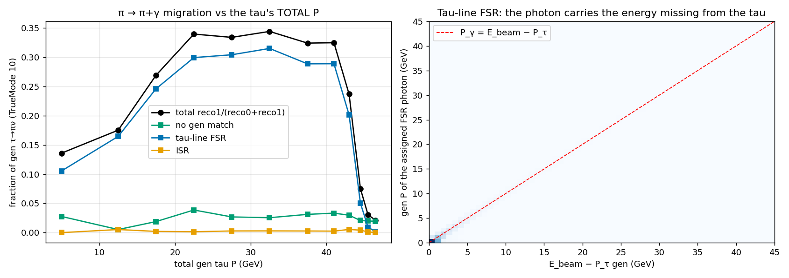

Frente al P visible (`origen_fig_migracion_P_cos.png`) las dos componentes se cruzan: el FSR
baja con P visible (un tau que ha radiado un fotón duro no puede dar un pión de 40 GeV) y el
fragmento de shower sube (escala con el P del pión). Frente a |cos θ| no hay una acumulación
en la transición barrel/endcap: el fragmento vale 1.7-2.7 % en todo el rango.

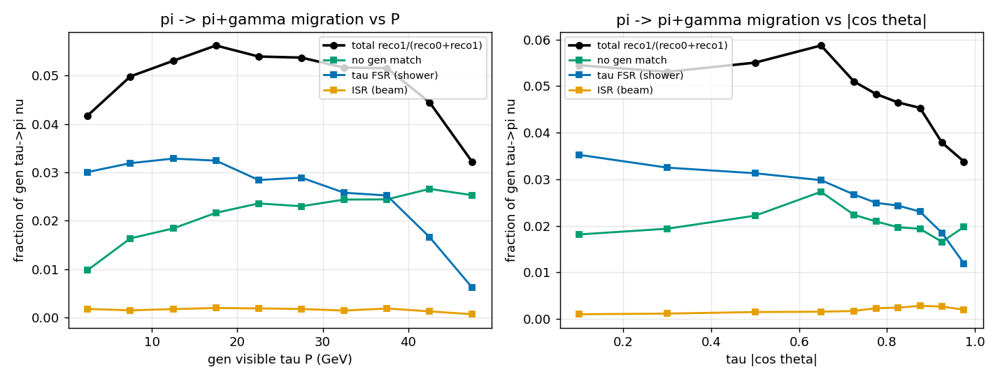

### 1.1 Por qué pintar frente al P visible no arregla nada

Pregunta natural: si la caída sólo se ve frente a `GenTauP`, ¿basta con usar el P visible, o
con un corte en P visible? No. En τ→πν el visible **es** el pión, y el pión se lleva una
fracción aleatoria de la energía del tau, así que los taus radiativos se reparten por todo el
rango de P visible: son el 8 % del primer bin y el 2 % del último, sin ningún bin donde se
concentren.

| `GenVisTauP` (GeV) | N | fracción radiativa del bin (P_τ<44) | migración no radiativos | migración radiativos | migración total |
|---|---|---|---|---|---|
| 0-5 | 52 397 | 0.081 | 0.025 | 0.236 | 0.042 |
| 10-15 | 51 587 | 0.073 | 0.035 | 0.301 | 0.053 |
| 20-25 | 47 885 | 0.066 | 0.038 | 0.284 | 0.054 |
| 30-35 | 44 418 | 0.054 | 0.039 | 0.278 | 0.052 |
| 40-45 | 39 523 | 0.022 | 0.040 | 0.245 | 0.045 |

El 4-5 % plano no es un problema pequeño y uniforme: es la mezcla de una población limpia al
2.5-4 % y una población radiativa al 24-31 %. Pintar frente al P visible **diluye** el efecto,
no lo elimina, y esconde que un 6 % de la muestra tiene una eficiencia 30 puntos peor.

Un corte en P visible tampoco los separa, porque no está correlacionado con haber radiado:

| corte | conserva de todos los πν | conserva de los radiativos | pureza radiativa restante |
|---|---|---|---|
| ninguno | 1.000 | 1.000 | 0.062 |
| P visible > 10 GeV | 0.756 | 0.691 | 0.056 |
| P visible > 20 GeV | 0.521 | 0.423 | 0.050 |
| P visible > 30 GeV | 0.302 | 0.197 | 0.040 |

Cortar en 20 GeV tira la mitad de la muestra buena para bajar la contaminación radiativa del
6.2 % al 5.0 %. Es un precio absurdo, y además sesga el espectro de x = E_π/E_haz, que es
justo la variable de la polarización. La separación hay que hacerla con el fotón (sección 3),
no con el momento del tau.

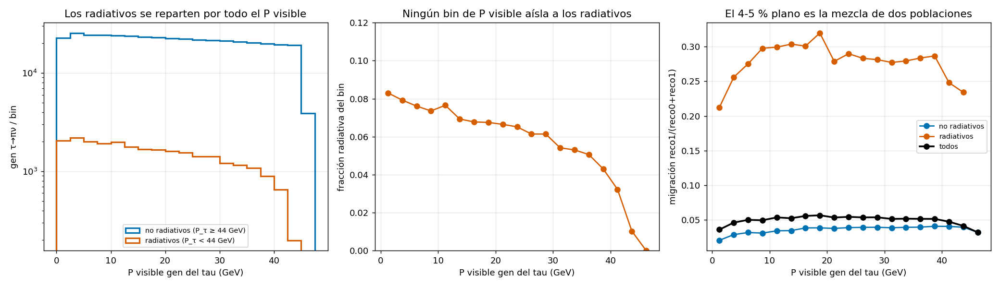

## 2. Origen del fotón

### 2.1 Desde el tree (18 763 taus gen tipo 0 → reco 1, fichero completo)

Clasificación vía `RecoPhotonGenMatchIdx` → `GenPhotonOrigin` / `GenPhotonTauKey` / `GenPhotonParentPDG`:

| origen | fracción | P_γ mediana (GeV) | dR(γ,π) mediana | m(π+γ) mediana (GeV) |
|---|---|---|---|---|
| FSR de la línea del tau (origen 1, TauKey −1) | 0.54 | 1.46 | 0.184 | 0.72 |
| sin match a fotón gen (fragmento shower del π) | 0.43 | 0.57 | 0.070 | 0.26 |
| ISR (origen 2, padre e±) | 0.03 | 0.37 | 0.28 | 0.56 |
| π0 del otro tau | 0.0004 (7 casos) | | | |
| radiación del pión en el generador (origen 2, padre π) | 0 en todo el fichero | | | |

Por modo verdadero: πν puro (TrueMode 10) y Kν (20) se comportan igual (56/41/3 %).
**K0 πν (23) y K K0 (27) son otra cosa**: el 99 % del "fotón" es el cluster del K0_L
identificado como fotón; el tree los marca con `GenTauHasExtraNeutrals`.

Comprobaciones adicionales:
- En `GenTauType==0` no existe ningún fotón hijo directo del tau status 2 (0 en 300 k
  eventos): Pythia no genera τ→πνγ radiativo en esta muestra. Todo el FSR está en la línea
  del tau antes de la desintegración.
- El fragmento de shower deja la traza intacta: P_π/P_gen = 1.00 y (P_π+P_γ)/P_gen = 1.02.
  En un 9-11 % de los casos P_π/P_gen < 0.8 (interacción nuclear temprana).
- El 2.4 % de los τ→πν tienen un FSR gen con P>0.5 GeV dentro de dR<0.4, y el 77 % de ellos
  acaba asignado al reco tau con eficiencia plana en P_γ (`origen_fig_fsr_gen_vs_reco.png`).
  ISR en cono: 0.11 % de los taus.
- reco 2 en gen πν (0.35 %): 65 % dos fragmentos, 13 % FSR+fragmento, 10 % dos FSR, 9 % η→γγ.

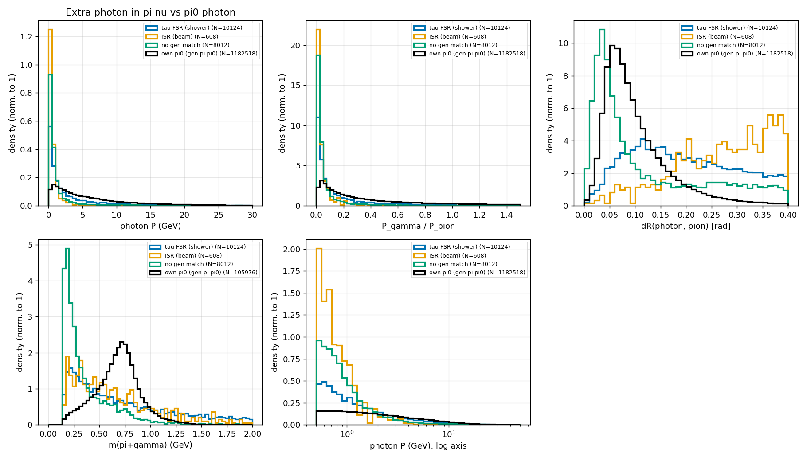

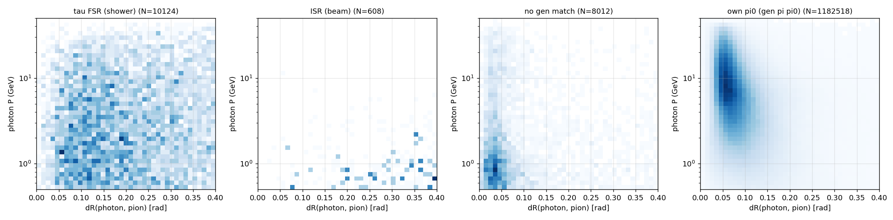

### 2.2 Desde el EDM4hep original (25 000 eventos, 218 casos)

Los 218 PFO fotón tienen un cluster, cero trazas y al menos un `RecoMCTruthLink`
(83 % con uno solo, peso de cluster ≈ 1). Clasificación por el mejor link, siguiendo los
padres hasta el generador:

| categoría | N | % | E_γ mediana (GeV) | ángulo cluster γ – cluster π (rad) |
|---|---|---|---|---|
| FSR del propio tau (γ status 1, padre copia del tau status 23/51/52) | 122 | 56 | 1.45 | 0.18 |
| fragmento del shower del pión (link al π± gen, o a secundarias de sim descendientes de él) | 74 | 34 | 0.48 | 0.036 (44/74 a <0.05) |
| ISR blando | 13 | 6 | 0.31 | 0.20 |
| K0_L de τ→K0πν | 6 | 2.8 | 13 | 0.07 |
| FSR del otro tau | 2 | 0.9 | | |
| π0 del otro tau / radiación del π gen / sin link | 0 / 0 / 0 | | | |

Los fragmentos son ECAL puro, y 17/74 son "splash" lejano (>0.2 rad, 0.17 GeV). Sumando
E(cluster π)+E_γ se recupera E/p = 0.98 frente a 0.94 sin el fotón: es energía del pión
repartida en dos clusters. Sólo 9/196 casos están en la zona de transición.

El ISR duro no es un problema: 1.9 % de los fotones ISR tienen E>1 GeV, 0.2 % E>5 GeV, y
los de E>5 GeV caen a dR<0.4 de un tau en el 0.6 % de los casos.

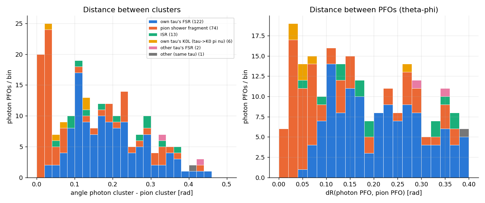

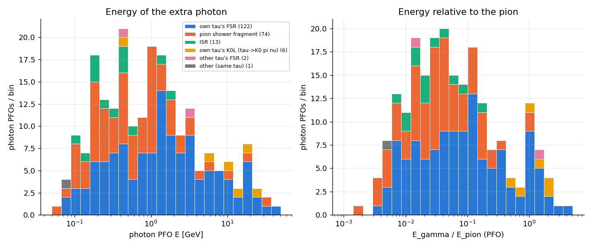

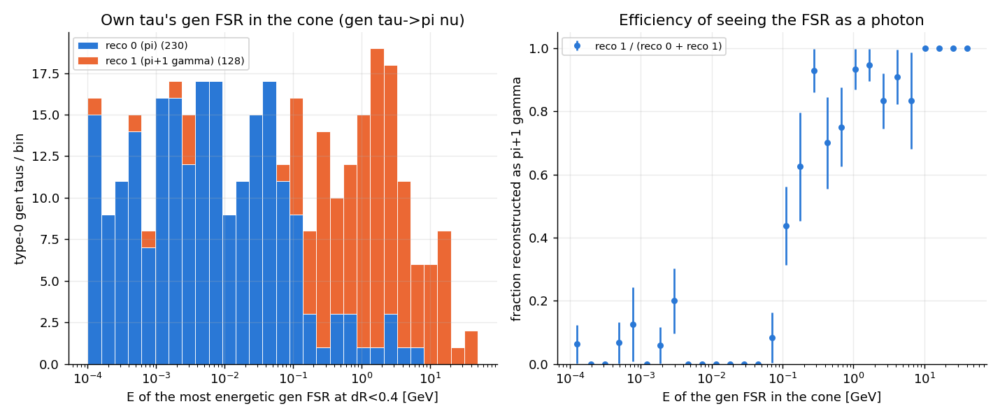

Pandora reconstruye el FSR como fotón con eficiencia >0.6 a partir de 0.1-0.2 GeV y ~0.9 por
encima de 1 GeV: la migración es prácticamente la fracción de taus con un FSR en cono por
encima de ese umbral.

## 3. Discriminación

Todo se emula sobre el tree re-contando los fotones que sobreviven en el cono y recalculando
`RecoTauType`, DM = ceil(nγ/2), masa y P (verificado que sin cortes reproduce el tree al 100 %
en 1-prong). Eficiencias con denominador = todos los gen taus del tipo, incluidos los no
emparejados.

### 3.1 Cortes fijos en P (lo que no hay que hacer)

| corte | Δe0 | Δe1 | Δe2 | Δe3 | Δe10 | Δe12 |
|---|---|---|---|---|---|---|
| P_γ < 0.5 GeV | +0.015 | +0.015 | −0.008 | −0.049 | +0.021 | +0.004 |
| P_γ < 1 GeV | +0.022 | +0.013 | −0.061 | −0.157 | +0.034 | −0.029 |
| P_γ < 2 GeV | +0.029 | −0.015 | −0.196 | −0.345 | +0.047 | −0.142 |

### 3.2 La pareja π0 es la clave para la parte blanda

Un fotón de π0 casi siempre tiene otro fotón en el cono con |m_γγ − m_π0| < 50 MeV (mediana
9 MeV); el fotón extra está solo. Condicionar cualquier corte a "sin pareja" multiplica por ~4
el rechazo a igual pérdida (ROC por fotón: al 1 % de pérdida de fotones de π0, de 11-15 % a
44-47 % de rechazo).

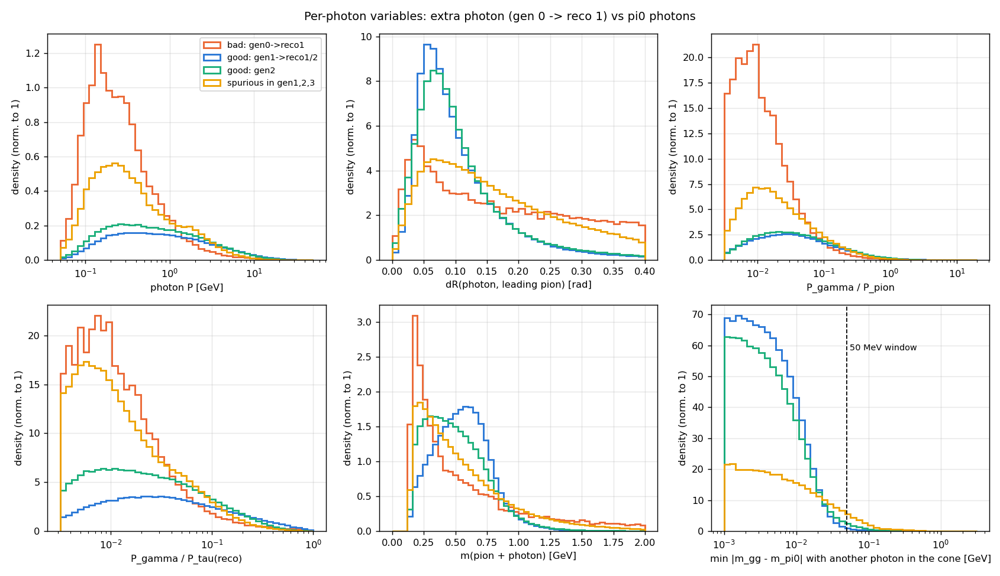

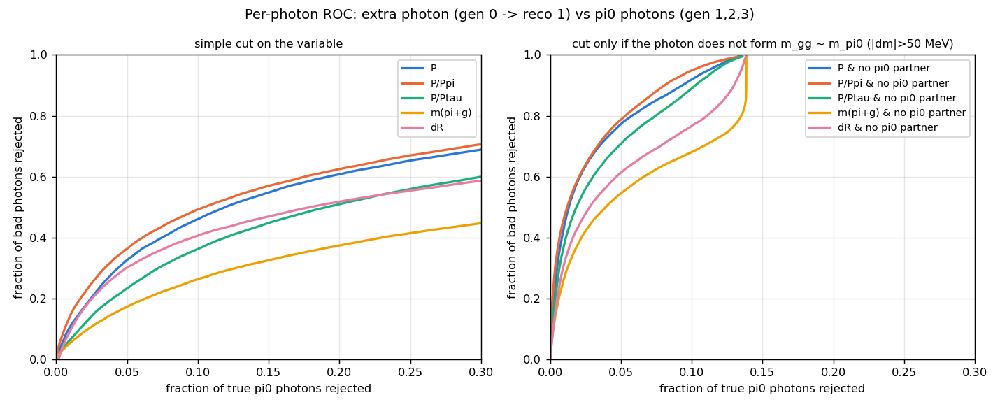

Puntos de trabajo blandos (todos recuperan ~54 % de la migración, la parte de fragmento + FSR blando):

| punto de trabajo | Δe0 | Δe1 | Δe2 | Δe3 | Δe10 | Δe11 | Δe12 | Δe0 / Δe1 / Δe2 (VisP 20-40) |
|---|---|---|---|---|---|---|---|---|
| WP-A: sin pareja & P_γ<1 GeV | +0.022 | +0.000 | −0.006 | −0.005 | +0.031 | +0.003 | −0.001 | +0.023 / +0.008 / −0.006 |
| **WP-C: sin pareja & P_γ/P_π<0.05** | +0.020 | −0.003 | −0.004 | −0.003 | +0.017 | +0.002 | +0.001 | +0.026 / −0.000 / −0.004 |
| WP-D: sin pareja & P_γ<0.3·√P_π | +0.024 | −0.004 | −0.007 | −0.005 | +0.027 | +0.003 | −0.000 | +0.027 / +0.002 / −0.008 |

WP-A cuesta 0.06-0.10 en gen 1 por debajo de 10 GeV de P visible; WP-C no toca gen 1 a baja P
y por eso es el preferido. Con dR solo no se separa el fragmento (está a dR~0.07, más cerca
que muchos fotones de π0).

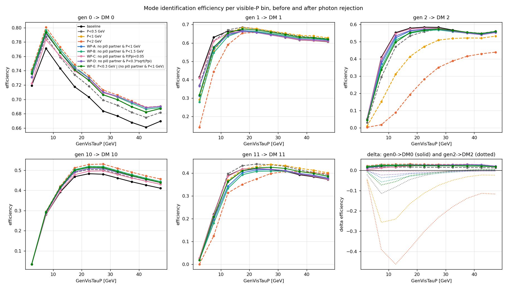

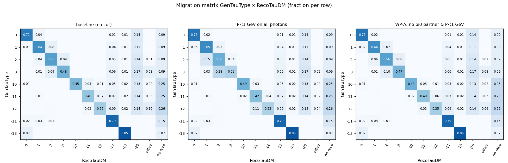

### 3.3 El FSR duro: la masa π+γ

En la ventana `GenTauP` 20-40 el fotón es duro (P mediana 7-23 GeV) y WP-C no lo toca. El
competidor es el fotón huérfano de un π0 con el otro fotón perdido (gen 1 → reco 1), que es
igual de duro. Lo que los separa es que un ρ no puede dar **m(π+γ) > m_ρ**:

| población (fotón sin pareja, P>2 GeV) | dR(γ,π) p10/50/90 | m(π+γ) p10/50/90 (GeV) |
|---|---|---|
| FSR duro, `GenTauP` 20-40 | 0.07 / 0.19 / 0.35 | 0.71 / 1.88 / 4.52 |
| π0 huérfano gen 1 → reco 1 | 0.04 / 0.08 / 0.18 | 0.51 / 0.73 / 0.97 |

| criterio sobre el fotón duro sin pareja | rechazo FSR (20-40) | pérdida de π0 huérfano |
|---|---|---|
| dR > 0.2 | 0.48 | 0.077 |
| m(π+γ) > 1.0 GeV | 0.80 | 0.083 |
| **m(π+γ) > 1.2 GeV** | 0.72 | 0.023 |
| m(π+γ) > 1.5 GeV | 0.62 | 0.002 |

dR respecto al pión discrimina algo restringido a fotones duros, pero la masa (que ya contiene
dR y P) es muy superior. dR respecto a la dirección del tau reco no aporta nada (el tau reco lo
define el propio fotón duro), y el FSR tampoco es más colineal con el tau gen (dR 0.18).

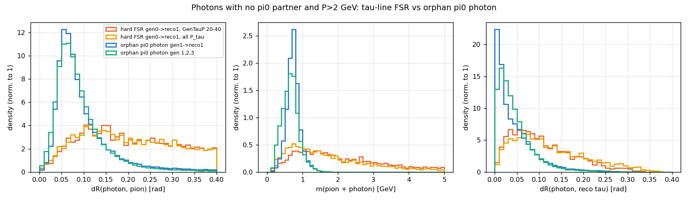

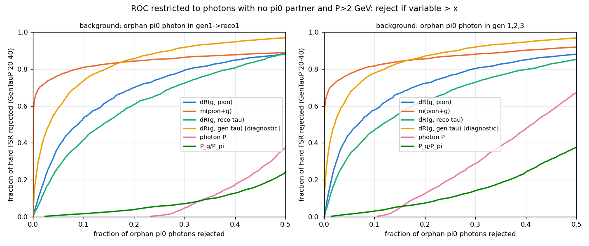

Eficiencias en bins de `GenTauP` (fichero completo):

| criterio | e0 20-40 | e1 20-40 | e2 20-40 | e0 global | e1 global | e2 global |
|---|---|---|---|---|---|---|
| baseline | 0.478 | 0.460 | 0.446 | 0.707 | 0.640 | 0.563 |
| H: m>1.2 | 0.638 | 0.559 | 0.499 | 0.713 | 0.644 | 0.565 |
| H: m>1.0 | 0.656 | 0.571 | 0.502 | 0.713 | 0.643 | 0.562 |
| **WP-C + H: m>1.2** | **0.655** | **0.550** | **0.493** | **0.733** | **0.640** | **0.561** |
| WP-C + H: m>1.0 | 0.672 | 0.561 | 0.497 | 0.734 | 0.638 | 0.558 |

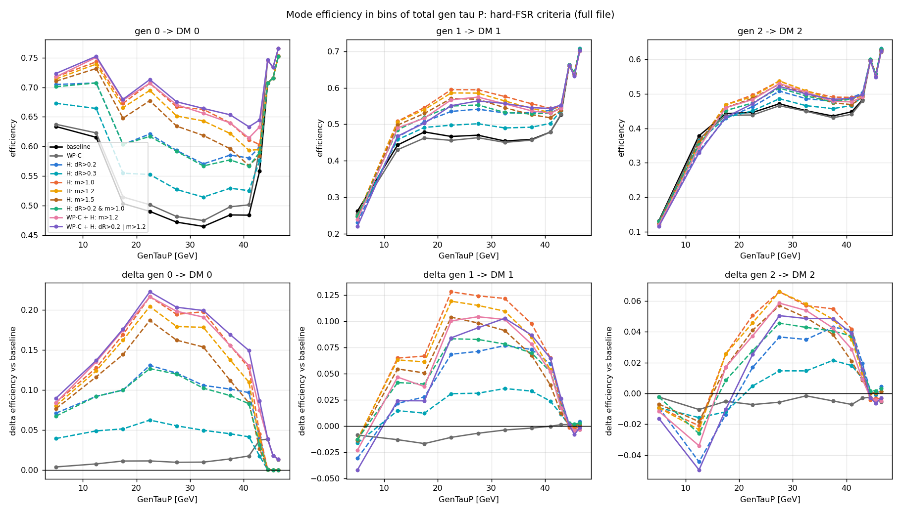

Por bin de `GenTauP`, gen 0 → DM 0 con el criterio recomendado: 0.72 / 0.75 / 0.68 / 0.71 /
0.67 / 0.66 / 0.64 / 0.61 / 0.63 (bins 0-10 … 42-44) frente a 0.63 / 0.62 / 0.50 / 0.49 /
0.47 / 0.47 / 0.48 / 0.48 / 0.56 en baseline. Por encima de 44 GeV sólo actúa WP-C (+0.02-0.04).

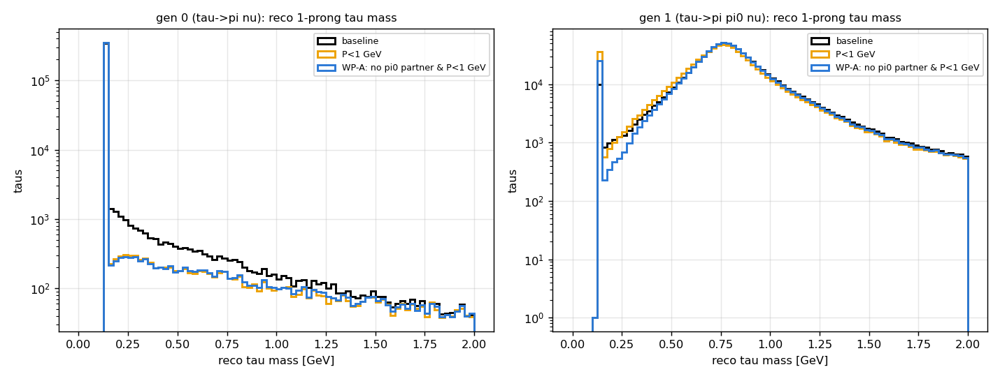

## 4. Recomendaciones

1. **Reco (`buildTauFromPion`)**, para 1-prong y sólo sobre fotones del cono sin pareja π0
   (|m_γγ − 0.135| ≥ 0.05 GeV con todos los demás fotones del cono): descartar el fotón si
   P_γ/P_π < 0.05, o si P_γ > 2 GeV y m(π+γ) > 1.2 GeV. Recupera +0.18 en gen 0 → DM 0 y
   +0.09 en gen 1 → DM 1 en 20-40 GeV de P total, con coste ≤ 0.004 en cualquier otra
   categoría. Si se prefiere no tocar nada blando, sólo la parte m>1.2 da +0.16 / +0.10 / +0.05.

   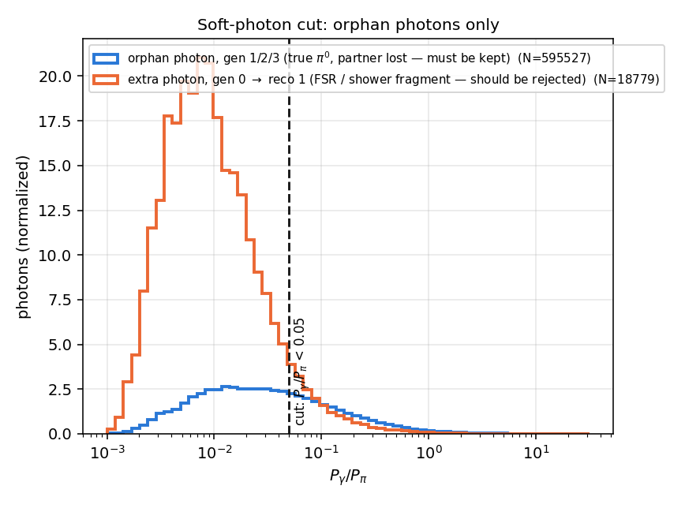

   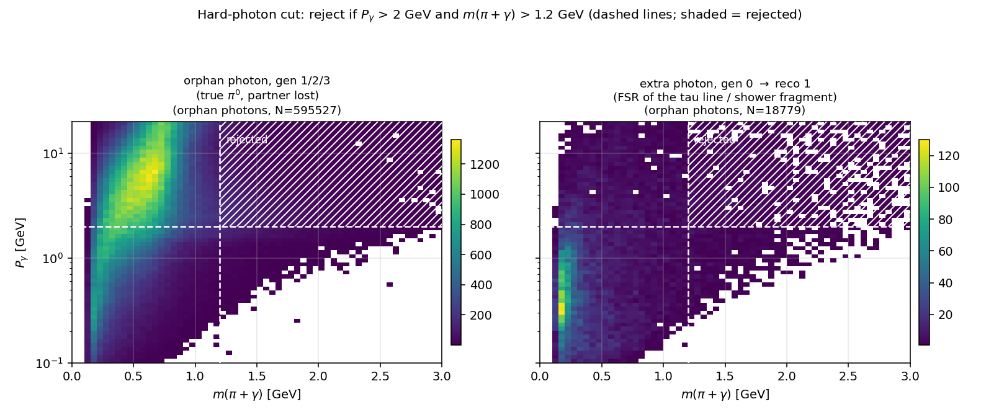
2. **Gen (`visTauGen`)**: añadir los fotones FSR de la línea del tau (origen 1, TauKey −1)
   dentro de dR<0.4 como constituyentes, o al menos un flag `GenTauHasLineFSR` y su P, para
   que la matriz de migración no cuente como error un fotón real. Lo mismo para los K0
   (`GenTauHasExtraNeutrals` ya existe).
3. **Polarización**: los eventos con FSR duro tienen E_τ = E_haz − P_γ. Aunque el corte los
   devuelva a la categoría πν, la variable x = E_π/E_haz está sesgada; conviene tratar el
   subconjunto con un fotón rechazado por masa como categoría radiativa aparte o corregir
   E_τ con P_γ.
4. Atacar por separado el π→neutrón (−20), que es la pérdida dominante de τ→πν a alto P y no
   se toca con nada de lo anterior.

## 5. Implementación en el pipeline

La recomendación 1 está implementada en `modules/tauReco.py` como
`extraTauRecoCorrection`, que se aplica al final de `buildTauFromPion` sobre el tau ya
construido. Es un registro de modos: cada corrección es una función decorada con
`@registerExtraCorrection("nombre")` que recibe el estado del tau (`p4`, `id`, `charge`,
`maxCone`, `nConst`, `const`, `counts`), puede quitar constituyentes y devuelve el estado;
`_rebuildTauState` recalcula P4, carga, cono e ID con `assignTauID`. Añadir un criterio
nuevo no toca `buildTauFromPion`: basta registrar la función y pedirla en la configuración.

El modo implementado es **`pion_photon_fsr`** (`recoverPionFromExtraPhoton`): sólo actúa en
1-prong sin neutrones, protege los fotones con pareja a masa de π0 y descarta los huérfanos
que cumplen `P_γ/P_π < soft_frac` o (`P_γ > hard_p_min` y `m(π+γ) > mass_min`).

Configuración por YAML (ejemplo listo en `config/default/taurecolong_pion_fsr.yaml`):

```yaml
extra_reco_correction:
  enable: true
  modes: [pion_photon_fsr]
  params:
    pion_photon_fsr:
      pi0_mass_window: 0.05
      soft_frac: 0.05
      hard_p_min: 2.0
      mass_min: 1.2
      max_photons: 0      # 0 = sin límite de fotones en el cono
```

o por línea de comandos, con la misma prioridad que el resto de cortes:

```bash
python TauAnalysis/TTreesTausLong.py -c config/default/taurecolong.yaml \
       --extra-correction pion_photon_fsr \
       --extra-correction-param pion_photon_fsr.mass_min=1.4
# --no-extra-correction desactiva lo que active el YAML
```

Sin configuración el comportamiento es idéntico al baseline (`extra_correction=None`).
**Ojo:** el nombre del fichero de salida no cambia al activar la corrección; usar `--prefix`
si no se quiere sobrescribir un árbol base.

Validación (`test/test_extra_correction.py`, eventos sintéticos): FSR duro y fragmento
blando se eliminan, el ρ con π0 real y el π0 con un fotón perdido no se tocan. Sobre 8000
eventos de `ztt_2M` (todo el espectro de P, sin binear):

| gen | reco | base | corregido |
|---|---|---|---|
| 0 (π ν) | DM 0 | 0.714 | **0.738** |
| 0 (π ν) | DM 1 | 0.035 | **0.012** |
| 1 (π π0) | DM 1 (reco 1+2) | 0.644 | 0.643 |
| 1 (π π0) | DM 3 (reco 3-9) | 0.086 | 0.072 |
| 3-prong (gen 10/11/12) | todo | — | sin cambios |

El +0.024 inclusivo es el mismo efecto que en 20-40 GeV de P total vale +0.18: ahí se
concentra la migración.

## Ficheros

- `figs/fig_migracion_vs_GenTauP.png`, `scripts/ptau_origin.py`, `scripts/baseline_full.py`: tablas base y descomposición por P total.
- `figs/origen_*`, `scripts/origen_extract.py`, `scripts/origen_analyze.py`: origen desde el tree.
- `figs/raw_*`, `scripts/photon_links.py`, `scripts/summarize.py`: verificación en EDM4hep con podio.
- `figs/discrim_*`, `scripts/discrim_*.py`: emulación de criterios, ROC, matrices y eficiencias.
