# El fotón extra en τ→πν: origen y discriminación — muestra `ztt_2M_smearing`

Repetición exacta del análisis de `docs/pi_extra_photon/` (muestra `ztt_2M`) sobre la muestra
`ztt_2M_smearing` (`Ztt_SM_2M_SigmaZ`, CLD full sim, 2 M eventos, la misma que
`merged_CLD_FCC_2M_OptCutsCLD_smearingChanged_*`). Tree sin cortes
`Results/TauReco/New2MSample_smearing_results0.4_tph0.0_tpi0.0_n0.0_g0.0/Tree_resultsdecayAll_0.4_tph0.0_tpi0.0_n0.0_g0.0.root`
(cono dR<0.4, sin corte en P de fotones ni pión, `MatchedGenMaxDR` 1, misma config que el original).
Verificación independiente sobre 25 ficheros EDM4hep (`out_reco_edm4hep_1000..1024`, 25 000 eventos) con podio.
Scripts en `scripts/` (reproducir todo con `scripts/run_all.sh`), figuras en `figs/` con los mismos nombres que el original.

Donde es útil, las cifras se dan como **original → smearing**.

## Resumen ejecutivo

**Las conclusiones del original se mantienen todas.** Lo que cambia es el nivel base, no el mecanismo:

- **Menos taus sin emparejar.** En gen 0 el reco 0 sube 3-10 puntos. La fracción sin match pasa de 0.075-0.16 a 0.03-0.04. El baseline e0 pasa de 0.707 a 0.744 y e1 de 0.640 a 0.663.
- **Migración π→π+γ igual.** Es el mismo 4-5 % frente a P visible (5.1 % global) y 31-34 % en 20-40 GeV de P total.
- **El criterio recomendado gana algo más:** +0.19 en gen 0 → DM 0 en 20-40 GeV, frente a +0.18.

1. **La caída de eficiencia de τ→πν está en el P total del tau, no en el visible.**
   - Frente a `GenVisTauP` la migración π→π+γ es un 4.4-5.5 % casi plano.
   - Frente a `GenTauP` sube al **31-34 % entre 20 y 40 GeV**, y al 12-25 % por debajo de 20 GeV. En el original era 25-34 % y 14-20 %.
   - Un tau con P total muy por debajo de E_haz = 45.6 GeV es un tau que ha radiado.
2. **El fotón extra es real en el 54 % de los casos (tree) y es FSR de la línea del tau.**
   - Su momento es **P_γ ≈ E_haz − P_τ**. En la ventana 20-40 GeV de `GenTauP` es un fotón de 7-23 GeV y explica el 90-92 % de la migración (88-91 % en el original).
   - El otro 43 % es un **fragmento del shower hadrónico del pión** (cluster ECAL blando, pegado al pión). Queda un 3 % de ISR blando.
   - No hay π0 del otro tau (8 casos en todo el fichero), ni radiación del pión en el generador, ni ISR duro.
   - En EDM4hep el reparto es 64 % FSR / 28 % fragmento / 5 % ISR, frente a 56 / 34 / 6 en el original. La estadística es pequeña: 222 casos.
3. **No es contaminación de otra categoría**, y no se arregla con un corte fijo en P de los fotones. P<1 GeV cuesta −0.059 en gen 2 y −0.150 en gen 3; en el original, −0.061 y −0.157.
4. **Criterio recomendado** (idéntico al original): rechazar el fotón si **no tiene pareja π0** y (**P_γ/P_π < 0.05** o (**P_γ > 2 GeV y m(π+γ) > 1.2 GeV**)). Resultado sobre el fichero completo:

   | eficiencia gen X → DM X | baseline | recomendado | Δ | Δ original |
   |---|---|---|---|---|
   | gen 0 → DM 0, global | 0.744 | 0.772 | +0.028 | +0.027 |
   | gen 0 → DM 0, `GenTauP` 20-40 | 0.502 | 0.690 | **+0.187** | +0.176 |
   | gen 1 → DM 1, global | 0.663 | 0.664 | +0.001 | 0.000 |
   | gen 1 → DM 1, `GenTauP` 20-40 | 0.476 | 0.574 | +0.098 | +0.090 |
   | gen 2 → DM 2, global | 0.576 | 0.575 | −0.001 | −0.002 |
   | gen 3 → DM 3, global (sólo parte blanda) | 0.474 | 0.472 | −0.002 | −0.003 |
   | gen 10 → DM 10, global (sólo parte blanda) | 0.483 | 0.499 | +0.016 | +0.017 |
   | e → DM 0, μ → DM 0 | 0.035 / 0.084 | 0.037-0.046 / 0.084-0.085 (WP blandos) | ≈+0.002-0.01 / 0 | |

   La fila e/μ sale de las matrices de migración de esta muestra. El original daba 0.017 / 0.073, pero esas matrices no se guardaron y no puedo comprobar que sea la misma definición. No la comparo.
5. **A nivel gen** sigue valiendo lo mismo: hay que contar el FSR de la línea del tau (GenPhotonOrigin==1, TauKey −1, dR<0.4) o marcar el evento como τγ radiativo, con E_τ = E_haz − P_γ.
6. **La misidentificación π→neutrón (`RecoTauType == −20`) es aún algo mayor.** Sube del 3.9 % al 22 % entre 0 y 45 GeV de P visible (del 3 % al 21 % en el original) y es del 12-14 % en toda la ventana de `GenTauP`. Sigue siendo la pérdida dominante de τ→πν a alto P.

## 0. Qué cambia respecto a `ztt_2M`

| | `ztt_2M` | `ztt_2M_smearing` |
|---|---|---|
| gen taus | 4 000 097 | 4 000 116 |
| con reco emparejado | 3 507 148 (87.7 %) | 3 757 615 (93.9 %) |
| eventos sin ningún reco tau | 40 395 | 20 568 |
| gen 0: e0 / sin reco | 0.707 / ~0.09 | 0.744 / 0.038 |
| gen 0 → reco 1 (taus) | 18 779 (3.9 %) | 19 948 (4.1 %) |
| gen 0 → reco −20 (global) | ~0.135 | 0.143 |
| EDM4hep 25 k ev: gen 0 matched / sin match | 5455 / 546 | 5754 / 242 |

- **El cambio principal es de emparejamiento:** la mitad de los gen taus que antes quedaban sin reco (dR<1) ahora se emparejan. Es coherente con el arreglo del smearing en z del vértice, que en la muestra vieja sesgaba la dirección reconstruida.
- **A dónde van los recuperados:** en su mayoría a reco 0. Una parte acaba en −20, que sube ~1 punto.
- **Lo que no cambia:** la física del fotón extra (FSR / fragmento / ISR, cinemática, masas, ROC) es la misma dentro de la estadística.

## 1. Dónde está la caída

Tabla base (fichero completo, gen tipo 0, fracción de cada resultado reco):

| `GenVisTauP` (GeV) | N | reco 0 | reco 1 | reco 2 | reco −20 | sin match |
|---|---|---|---|---|---|---|
| 0-5 | 52 944 | 0.819 (0.719) | 0.038 | 0.004 | 0.039 | 0.040 (0.164) |
| 10-15 | 56 853 | 0.776 (0.743) | 0.044 | 0.004 | 0.108 | 0.042 (0.082) |
| 20-25 | 54 632 | 0.732 (0.703) | 0.045 | 0.004 | 0.162 | 0.036 (0.076) |
| 30-35 | 51 277 | 0.704 (0.677) | 0.042 | 0.004 | 0.194 | 0.034 (0.075) |
| 40-45 | 45 556 | 0.688 (0.661) | 0.034 | 0.004 | 0.218 | 0.033 (0.075) |

(entre paréntesis, el valor del original)

| `GenTauP` (GeV) | N | reco 0 | reco 1 | reco −20 | sin match |
|---|---|---|---|---|---|
| 10-15 | 549 | 0.645 | 0.149 | 0.086 | 0.042 |
| 15-20 | 713 | 0.585 | 0.191 | 0.108 | 0.046 |
| 20-25 | 1 067 | 0.530 | 0.241 | 0.118 | 0.044 |
| 25-30 | 1 540 | 0.508 | 0.253 | 0.128 | 0.034 |
| 30-35 | 2 610 | 0.492 | 0.254 | 0.130 | 0.044 |
| 35-40 | 5 267 | 0.500 | 0.257 | 0.135 | 0.043 |
| 40-42 | 4 741 | 0.524 | 0.242 | 0.138 | 0.036 |
| 42-44 | 12 816 | 0.587 | 0.180 | 0.149 | 0.039 |
| 44-45 | 64 867 | 0.742 | 0.062 | 0.139 | 0.027 |
| 45-46 | 331 474 | 0.755 | 0.025 | 0.143 | 0.043 |

- **Taus radiativos:** igual que en el original, sólo el 6.2 % de los τ→πν tienen P_τ < 44 GeV, y en ellos la migración a π+γ es de uno de cada cuatro. Reco 1 vale 0.25-0.27 en 20-40 GeV (τ→πν puro), frente a 0.24-0.27.
- **P_γ frente a E_haz − P_τ:** en todos los bins la mediana del P gen del FSR asignado coincide con E_haz − P_τ dentro de ~0.5 GeV (p. ej. 30-35: 12.74 frente a 12.86 GeV).

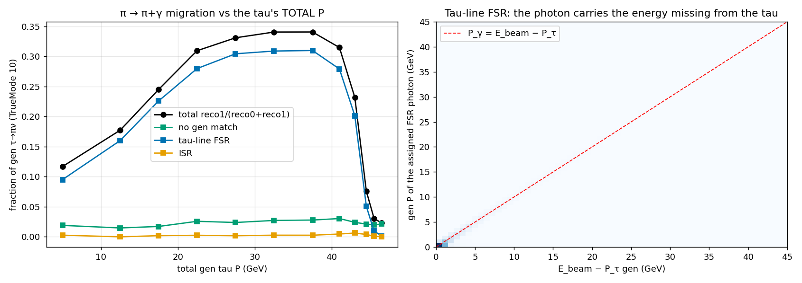

Frente al P visible (`origen_fig_migracion_P_cos.png`) las dos componentes se cruzan como en el original:
- **FSR:** baja con el P visible (del 3.0 % al 1.7 % de 0 a 45 GeV).
- **Fragmento de shower:** sube (del 1.3 % al 2.6 %).

Frente a |cos θ| no hay acumulación en la transición barrel/endcap: el fragmento vale 1.8-2.7 % en todo el rango.

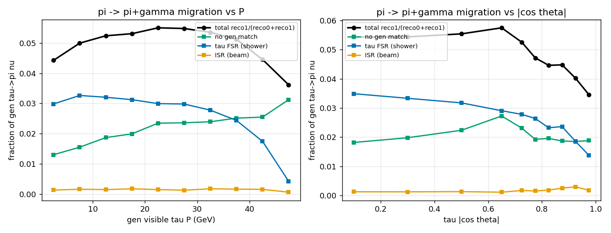

### 1.1 Por qué pintar frente al P visible no arregla nada

Los taus radiativos siguen repartidos por todo el rango de P visible: son el 8 % del primer bin y el 2 % del último.

| `GenVisTauP` (GeV) | N | fracción radiativa del bin (P_τ<44) | migración no radiativos | migración radiativos | migración total |
|---|---|---|---|---|---|
| 0-5 | 51 682 | 0.081 | 0.028 | 0.236 | 0.044 |
| 10-15 | 51 518 | 0.072 | 0.035 | 0.287 | 0.052 |
| 20-25 | 48 401 | 0.065 | 0.040 | 0.290 | 0.055 |
| 30-35 | 44 721 | 0.056 | 0.040 | 0.297 | 0.054 |
| 40-45 | 39 421 | 0.021 | 0.040 | 0.243 | 0.045 |

El 4-5 % plano es la mezcla de una población limpia al 2.8-4.0 % (2.5-4 % en el original) y una población radiativa al 24-30 % (24-31 %).

| corte | conserva de todos los πν | conserva de los radiativos | pureza radiativa restante |
|---|---|---|---|
| ninguno | 1.000 | 1.000 | 0.062 |
| P visible > 10 GeV | 0.756 | 0.689 | 0.057 |
| P visible > 20 GeV | 0.521 | 0.423 | 0.050 |
| P visible > 30 GeV | 0.302 | 0.200 | 0.041 |

Prácticamente idéntica al original. Cortar en 20 GeV tira la mitad de la muestra para bajar la contaminación del 6.2 % al 5.0 %.

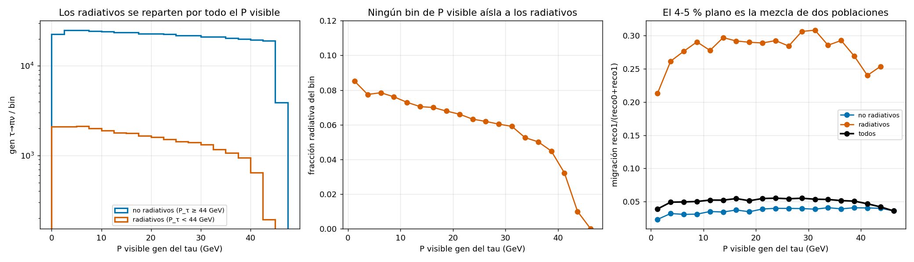

## 2. Origen del fotón

### 2.1 Desde el tree (19 932 taus gen tipo 0 → reco 1, fichero completo; 18 763 en el original)

| origen | fracción | P_γ mediana (GeV) | dR(γ,π) mediana | m(π+γ) mediana (GeV) |
|---|---|---|---|---|
| FSR de la línea del tau (origen 1, TauKey −1) | 0.54 (0.54) | 1.42 (1.46) | 0.188 (0.184) | 0.72 (0.72) |
| sin match a fotón gen (fragmento shower del π) | 0.43 (0.43) | 0.58 (0.57) | 0.069 (0.070) | 0.26 (0.26) |
| ISR (origen 2, padre e±) | 0.03 (0.03) | 0.39 (0.37) | 0.29 (0.28) | 0.58 (0.56) |
| π0 del otro tau | 0.0004 (8 casos) | | | |
| radiación del pión en el generador (origen 2, padre π) | 0 en todo el fichero | | | |

**Por modo verdadero:**
- **πν puro (TrueMode 10):** 56/41/3 %, igual que en el original.
- **Kν (20):** 49/48/3 %. En el original era 53/44/3; la diferencia está dentro de la estadística (1213 casos).
- **K0 πν (23) y K K0 (27):** el 98 % del "fotón" es el cluster del K0_L.

**Comprobaciones adicionales**, todas iguales que en el original:
- **Hijos directos del tau:** en `GenTauType==0` sigue sin haber ningún fotón hijo directo del tau status 2.
- **Balance de momento del fragmento:** P_π/P_gen = 1.00 y (P_π+P_γ)/P_gen = 1.02. En un 9-12 % de los casos P_π/P_gen < 0.8.
- **FSR en el cono:** el 2.4 % de los τ→πν tienen un FSR gen con P>0.5 GeV dentro de dR<0.4. El **81 %** de ellos acaba asignado al reco tau (77 % en el original), con eficiencia plana en P_γ (0.79-0.82). ISR en cono: 0.11 %.
- **reco 2 en gen πν:** 0.39 % (0.35 % en el original). Se reparte en 69 % dos fragmentos, 13 % FSR+fragmento, 8 % dos FSR y 7 % η→γγ.

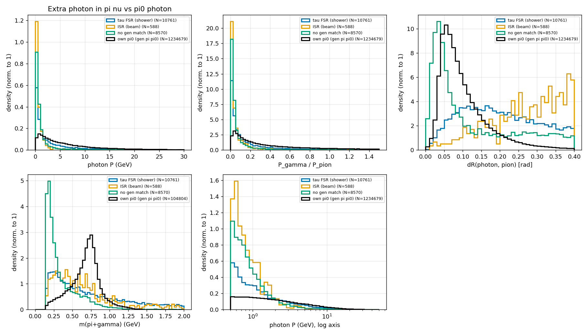

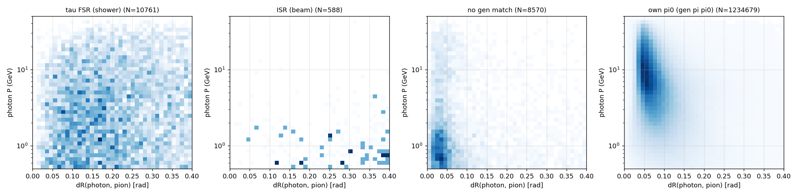

### 2.2 Desde el EDM4hep original (25 000 eventos, 222 casos; 218 en el original)

Los 222 PFO fotón tienen un cluster, cero trazas y al menos un `RecoMCTruthLink`: 76 % con uno solo (83 % en el original).

| categoría | N | % | E_γ mediana (GeV) | ángulo cluster γ – cluster π (rad) |
|---|---|---|---|---|
| FSR del propio tau | 141 | 64 (56) | 1.02 (1.45) | 0.13 (0.18) |
| fragmento del shower del pión | 63 | 28 (34) | 0.42 (0.48) | 0.031 (36/63 a <0.05) |
| ISR blando | 12 | 5 (6) | 0.31 | 0.24 |
| K0_L de τ→K0πν | 6 | 2.7 | 17 | 0.09 |
| FSR del otro tau | 0 (2) | | | |
| π0 del otro tau / radiación del π gen / sin link | 0 / 0 / 0 | | | |

- **Fragmentos:** son ECAL puro. 12/63 son "splash" lejano (>0.2 rad, 0.18 GeV).
- **Energía del pión:** sumando E(cluster π)+E_γ se obtiene E/p = 1.03, frente a 0.98 sin el fotón (0.98 y 0.94 en el original). Sigue siendo energía del pión repartida en dos clusters.
- **Transición barrel/endcap:** sólo 11/204 casos FSR+fragmento están en esa zona (9/196 en el original).
- **FSR más blando y colineal que en el original** (E 1.02 frente a 1.45 GeV, ángulo 0.13 frente a 0.18 rad). Con 141 casos no es significativo: en el tree completo la mediana de P_γ (1.42 frente a 1.46) y la de dR (0.188 frente a 0.184) no cambian.

El ISR duro sigue sin ser un problema: 1.9 % de los fotones ISR tienen E>1 GeV, 0.2 % E>5 GeV, y éstos caen a dR<0.4 de un tau en el 0.6 % de los casos.

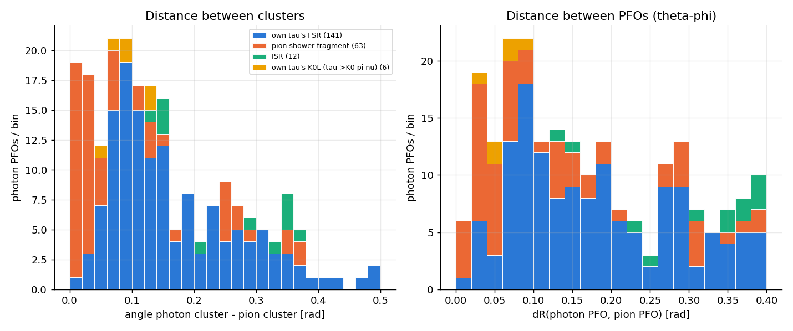

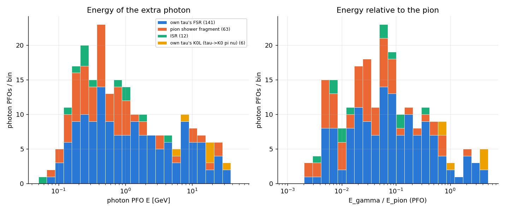

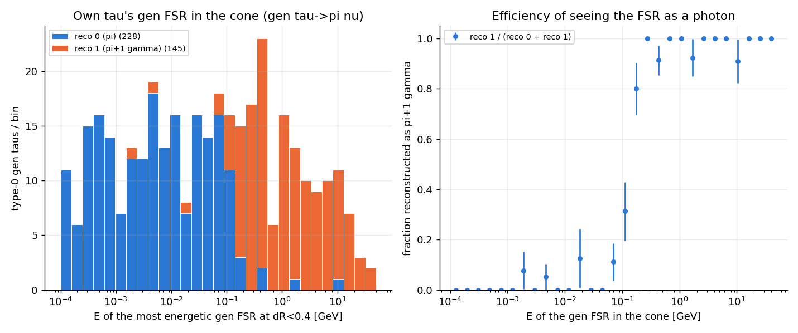

Pandora reconstruye el FSR como fotón con eficiencia ~0.55 en 0.1-0.2 GeV y ≳0.93 por encima de 0.2 GeV. En el original era 0.61 y ~0.8-0.9: es algo mejor en 0.2-1 GeV, pero con bins de 15-40 casos.

## 3. Discriminación

Misma emulación que el original: se re-cuentan los fotones del cono y se recalculan `RecoTauType`, DM, masa y P. El denominador son todos los gen taus del tipo.

### 3.1 Cortes fijos en P (lo que no hay que hacer)

| corte | Δe0 | Δe1 | Δe2 | Δe3 | Δe10 | Δe12 |
|---|---|---|---|---|---|---|
| P_γ < 0.5 GeV | +0.016 | +0.016 | −0.006 | −0.045 | +0.020 | +0.002 |
| P_γ < 1 GeV | +0.024 | +0.014 | −0.059 | −0.150 | +0.030 | −0.036 |
| P_γ < 2 GeV | +0.031 | −0.014 | −0.196 | −0.337 | +0.039 | −0.151 |

### 3.2 La pareja π0 es la clave para la parte blanda

ROC por fotón idéntica al original. Al 1 % de pérdida de fotones de π0, el rechazo pasa del 11-15 % al **44-47 %** si se exige "sin pareja".

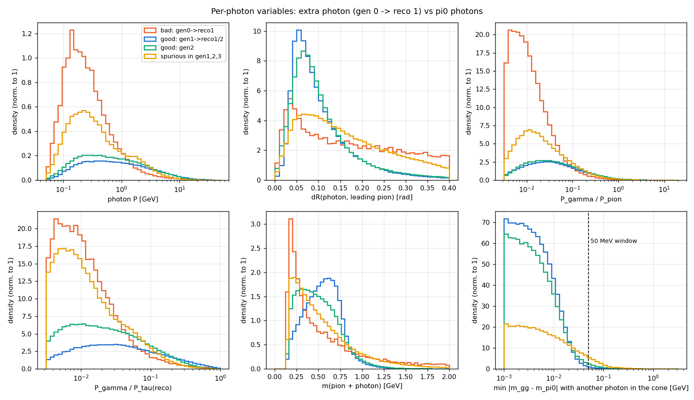

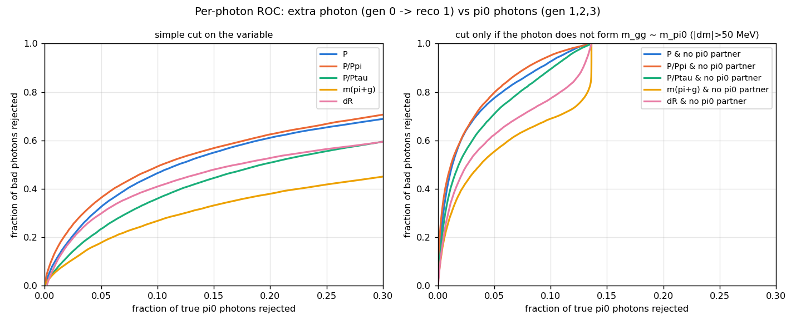

| punto de trabajo | recupera | Δe0 | Δe1 | Δe2 | Δe3 | Δe10 | Δe11 | Δe12 | Δe0 / Δe1 / Δe2 (VisP 20-40) |
|---|---|---|---|---|---|---|---|---|---|
| WP-A: sin pareja & P_γ<1 GeV | 54 % | +0.023 | +0.001 | −0.005 | −0.004 | +0.029 | +0.005 | −0.001 | +0.024 / +0.009 / −0.005 |
| **WP-C: sin pareja & P_γ/P_π<0.05** | 50 % | +0.022 | −0.002 | −0.003 | −0.002 | +0.016 | +0.003 | +0.001 | +0.028 / +0.000 / −0.004 |
| WP-D: sin pareja & P_γ<0.3·√P_π | 59 % | +0.025 | −0.003 | −0.007 | −0.004 | +0.026 | +0.004 | +0.000 | +0.029 / +0.003 / −0.007 |

- **WP-A:** sigue costando en gen 1 por debajo de 10 GeV de P visible: −0.11 en 0-5 GeV (0.387 frente a 0.494) y −0.06 en 5-10.
- **WP-C:** no toca gen 1 a baja P (0.490 frente a 0.494) y sigue siendo el preferido.

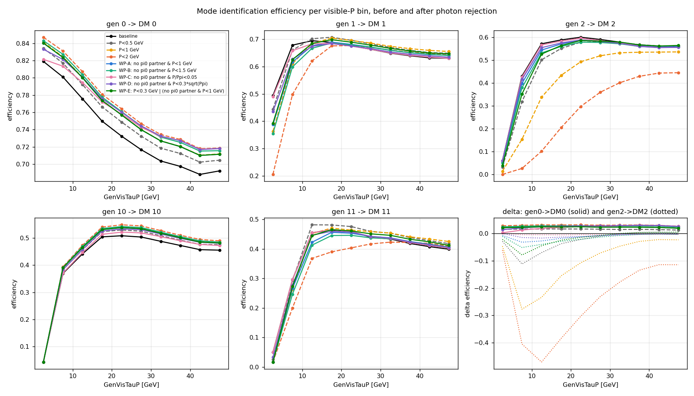

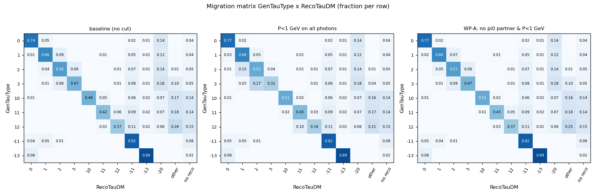

### 3.3 El FSR duro: la masa π+γ

| población (fotón sin pareja, P>2 GeV) | N | dR(γ,π) p10/50/90 | m(π+γ) p10/50/90 (GeV) |
|---|---|---|---|
| FSR duro, `GenTauP` 20-40 | 2 315 | 0.07 / 0.20 / 0.35 | 0.70 / 1.89 / 4.40 |
| π0 huérfano gen 1 → reco 1 | 80 215 | 0.04 / 0.08 / 0.18 | 0.53 / 0.73 / 0.93 |

| criterio sobre el fotón duro sin pareja | rechazo FSR (20-40) | pérdida de π0 huérfano | original |
|---|---|---|---|
| dR > 0.2 | 0.49 | 0.081 | 0.48 / 0.077 |
| m(π+γ) > 1.0 GeV | 0.80 | 0.064 | 0.80 / 0.083 |
| **m(π+γ) > 1.2 GeV** | 0.72 | **0.016** | 0.72 / 0.023 |
| m(π+γ) > 1.5 GeV | 0.62 | 0.001 | 0.62 / 0.002 |

La cola alta del π0 huérfano es algo más estrecha (p90 0.93 frente a 0.97 GeV), así que el corte en 1.2 GeV pierde aún menos. dR respecto al tau reco sigue sin aportar.

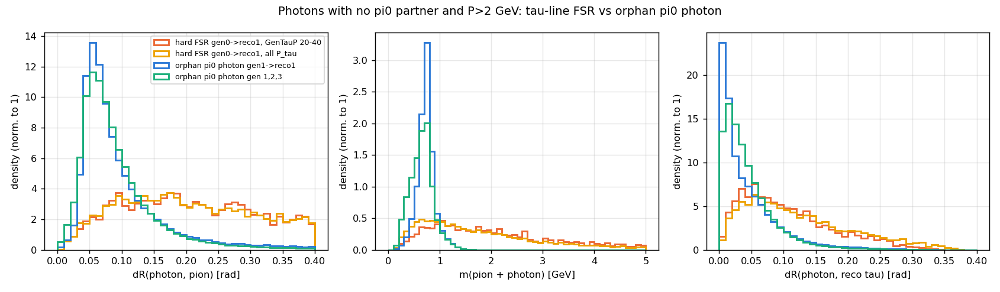

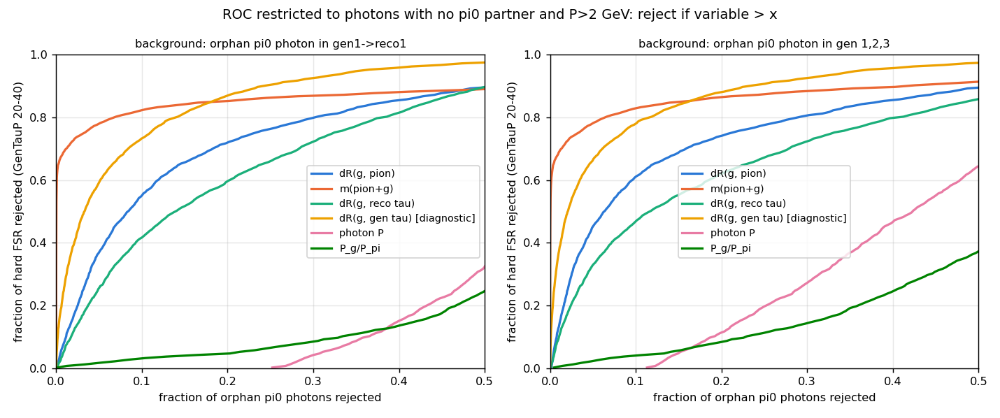

Eficiencias en bins de `GenTauP` (fichero completo):

| criterio | e0 20-40 | e1 20-40 | e2 20-40 | e0 global | e1 global | e2 global |
|---|---|---|---|---|---|---|
| baseline | 0.502 | 0.476 | 0.452 | 0.744 | 0.663 | 0.576 |
| H: m>1.2 | 0.670 | 0.580 | 0.517 | 0.751 | 0.667 | 0.578 |
| H: m>1.0 | 0.689 | 0.593 | 0.521 | 0.752 | 0.667 | 0.576 |
| **WP-C + H: m>1.2** | **0.690** | **0.574** | **0.514** | **0.772** | **0.664** | **0.575** |
| WP-C + H: m>1.0 | 0.709 | 0.586 | 0.518 | 0.773 | 0.663 | 0.572 |

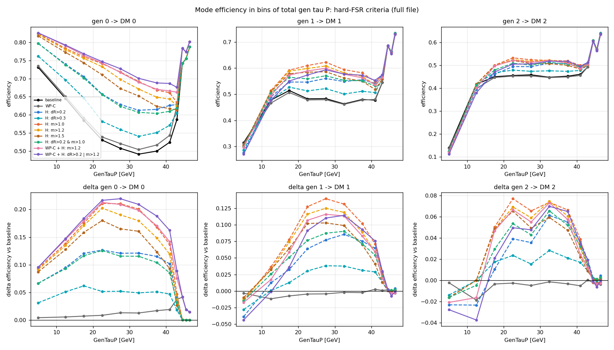

- **Recomendado frente a baseline, por bin de `GenTauP`** (gen 0 → DM 0, bins 0-10 … 42-44):
  - con el criterio: 0.83 / 0.79 / 0.76 / 0.74 / 0.72 / 0.69 / 0.67 / 0.67 / 0.66;
  - baseline: 0.73 / 0.65 / 0.59 / 0.53 / 0.51 / 0.49 / 0.50 / 0.52 / 0.59.
- **Por encima de 44 GeV** sólo actúa WP-C (+0.02-0.04).
- **Frente al original:** la eficiencia recomendada es ~0.1 más alta en todos los bins y la mejora es la misma o algo mayor.

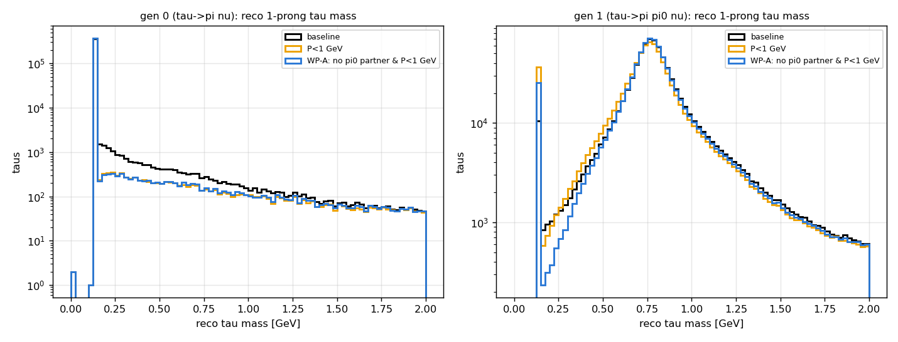

## 4. Recomendaciones

Las mismas que en el original, con las cifras de esta muestra:

1. **Reco (`buildTauFromPion`)**, sólo 1-prong y fotones del cono sin pareja π0: descartar el fotón si P_γ/P_π < 0.05, o si P_γ > 2 GeV y m(π+γ) > 1.2 GeV.
   - **Ganancia en 20-40 GeV de P total:** +0.19 en gen 0 → DM 0 y +0.10 en gen 1 → DM 1.
   - **Coste:** ≤ 0.003 en cualquier otra categoría.
   - **Sólo la parte m>1.2:** +0.17 / +0.10 / +0.06.

   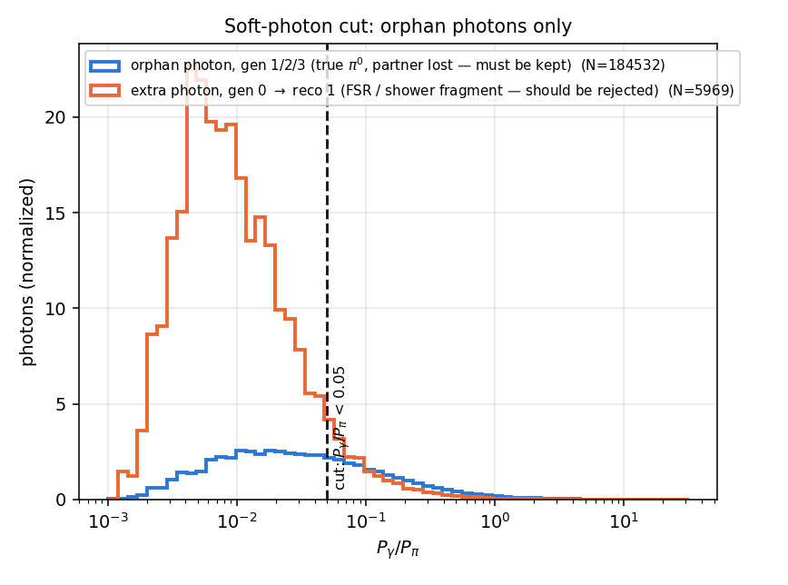

   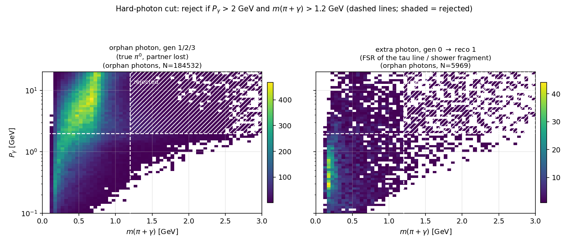
2. **Gen (`visTauGen`):** añadir el FSR de la línea del tau dentro de dR<0.4, o un flag `GenTauHasLineFSR`.
3. **Polarización:** tratar el subconjunto con un fotón rechazado por masa como categoría radiativa aparte, o corregir E_τ con P_γ.
4. **π→neutrón (−20):** atacarlo por separado. En esta muestra es aún un punto más alto (0.143 global en gen 0).

## 5. Validación de la corrección en el pipeline

Mismo `validate_corr.py` que el original (recuperado del código inline de entonces), aplicado a los ficheros 1000-1007 de `Ztt_SM_2M_SigmaZ`. Compara `findAllTaus` sin y con `extra_correction={pion_photon_fsr}`, con el `modules/tauReco.py` actual. El emparejamiento es "reco más cercano con dR<1", así que las fracciones no son las del tree.

| gen | reco | base | corregido | original (base → corr) |
|---|---|---|---|---|
| 0 (π ν, N=1865) | DM 0 | 0.753 | **0.776** | 0.714 → 0.738 |
| 0 (π ν) | DM 1 | 0.037 | **0.015** | 0.035 → 0.012 |
| 1 (π π0, N=4246) | DM 1 (reco 1+2) | 0.670 | 0.670 | 0.644 → 0.643 |
| 1 (π π0) | DM 3 (reco 3-4) | 0.083 | 0.071 | 0.086 → 0.072 |
| 1 (π π0) | DM 0 | 0.011 | 0.025 | no listado |
| 3-prong (gen 10/11/12) | DM 10-15 | — | sin cambios | sin cambios |

- **Mejora inclusiva:** en gen 0 es +0.023, la misma que en el original (+0.024).
- **Coste en gen 1:** la tabla original no mostraba la fila gen 1 → reco 0. Aquí se ve que la corrección pasa un 1.4 % de π π0 a DM 0 (π0 con un fotón perdido, cuyo fotón huérfano cae en el corte), y el mismo efecto aparece en la emulación del tree.
- **Balance en gen 1:** DM 1 no cambia porque ese coste se compensa con los DM 2→1 recuperados.

## Cambios respecto a `docs/pi_extra_photon/scripts`

- **Entradas:** en los 9 scripts que leen el tree sólo cambia `F=`, que apunta al tree nuevo. Los symlinks `out_reco_edm4hep_edm4hep_{1000..1024}.root` apuntan ahora a `Ztt_SM_2M_SigmaZ/out_reco_edm4hep_{i}.root`; se ha mantenido el nombre antiguo para no tocar `photon_links.py`.
- **Arreglo en `ptau_origin.py`, `baseline_full.py`, `origen_extract.py` y `discrim_extract.py`:**
  - **Síntoma:** en el tree nuevo, el evento 1 199 999 no tiene ningún reco tau y cierra un chunk de 100k/200k.
  - **Causa:** el truco `RecoTauType[where(has, rk, 0)]` indexa entonces fuera del buffer y awkward da `IndexError`. En el original ningún chunk acababa así; en mitad de chunk ese índice lee silenciosamente el valor del evento siguiente, que luego se enmascara.
  - **Arreglo:** rellenar las listas a ≥1 elemento (`pad1`/`padl`) antes de indexar. No cambia ningún resultado.
- **Scripts recuperados** del código inline de la sesión original (antes no existían como fichero): `visP_no_separa.py` (figura §1.1), `sec11_tables.py` (tablas §1.1) y `validate_corr.py` (§5).
- **`RESULTS.md`:** `origen_analyze.py`, `discrim_analysis.py` y `summarize.py` escribían los tres `RESULTS.md`. Aquí quedan como `RESULTS_origen.md`, `RESULTS_discrim.md` y `RESULTS_raw.md`.
- **Texto fijo en los scripts:** la sección "Conclusiones" de `RESULTS_discrim.md` es texto escrito en `discrim_analysis.py` con las cifras del original. Las de `RESULTS_raw.md` mezclan cifras nuevas con algunas fijas ("44/74", "218 casos"). Las cifras de este informe salen de las tablas, no de esos párrafos.

## Ficheros

- `figs/fig_migracion_vs_GenTauP.png`, `figs/fig_visP_no_separa.png`: `scripts/ptau_origin.py`, `scripts/visP_no_separa.py`, `scripts/sec11_tables.py`, `scripts/baseline_full.py` (tablas base y descomposición por P total).
- `figs/origen_*`: `scripts/origen_extract.py`, `scripts/origen_analyze.py` → `RESULTS_origen.md` (origen desde el tree).
- `figs/raw_*`: `scripts/photon_links.py`, `scripts/summarize.py` → `RESULTS_raw.md` (verificación en EDM4hep con podio).
- `figs/discrim_*`: `scripts/discrim_*.py` → `RESULTS_discrim.md`, `hard_RESULTS_section.md` (emulación de criterios, ROC, matrices y eficiencias).
- `figs/cutjust_*`: `scripts/cutjust_*.py` (justificación de los cortes).
- `scripts/validate_corr.py` → `validate_corr.log` (§5).
- Todo: `bash scripts/run_all.sh` (unos 10 minutos).
