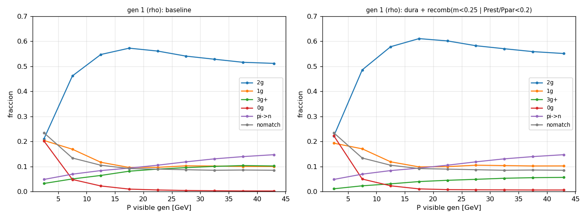
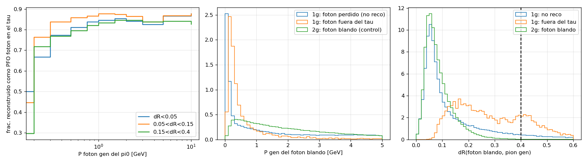
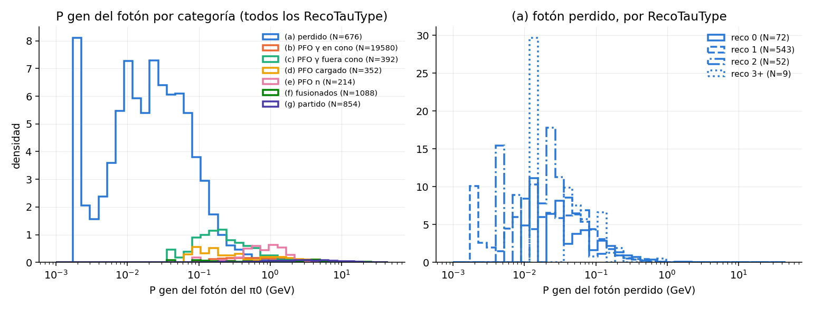
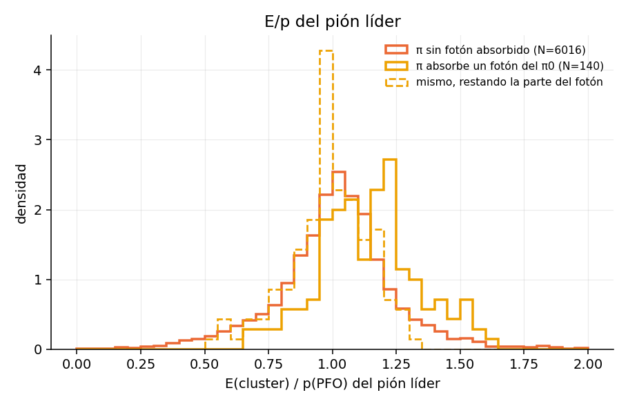
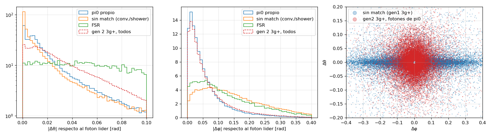
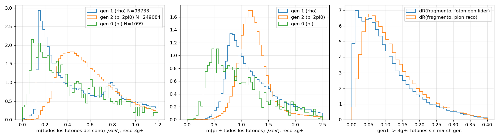
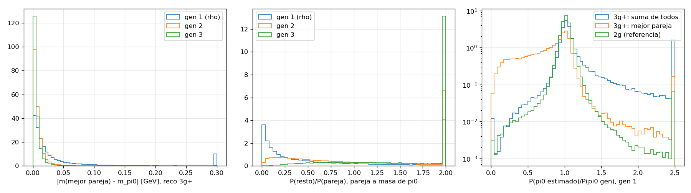
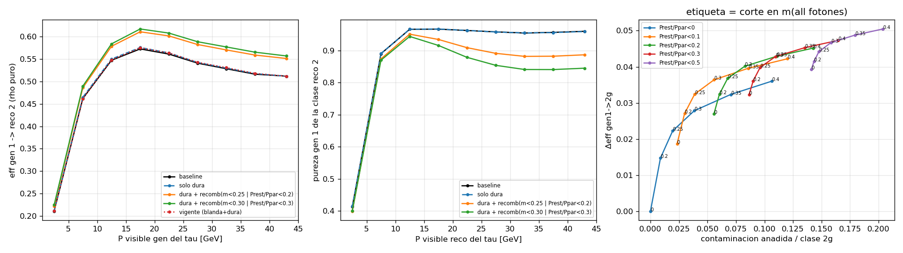
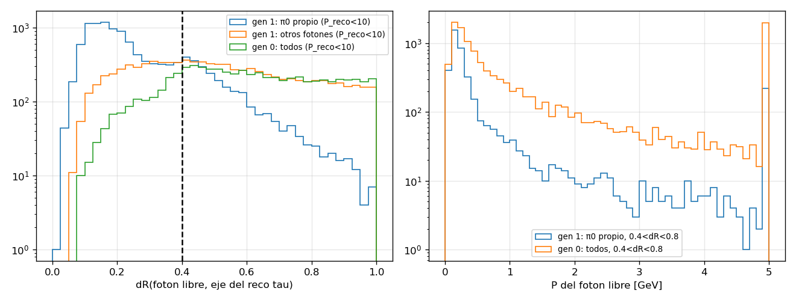

# La migración del ρ (τ→π π0 ν): origen de h+γ, h+3γ y h solo, y cómo recuperarla

Muestra `ztt_2M` (CLD full sim, 2 M eventos, 1 050 478 gen taus tipo 1), tree
`Results/TauReco/New2MSample_results0.4_tph0.0_tpi0.0_n0.0_g0.0/Tree_resultsdecayAll_0.4_tph0.0_tpi0.0_n0.0_g0.0.root`
(cono dR<0.4, sin cortes en P). Verificación con podio sobre 30 ficheros EDM4hep originales
(30 000 eventos, `raw/`). Definiciones: **ρ puro = `RecoTauType 2`** (1 pión + 2 fotones),
**gen ρ = `GenTauType 1`**. Scripts en `scripts/` (tablas `a*_*.md`), figuras en `figs/`,
estudio EDM4hep en `raw/RAW_SUMMARY.md`.

## Resumen ejecutivo

1. **No es contaminación externa: es el propio ρ mal contado.** El 96 % de los h+γ, el 97 % de los
   h+3γ y el 100 % de los h solos que salen de un gen ρ tienen el pión correcto y al menos un fotón real
   del π0. Lo que falla es el recuento de fotones, y por cuatro mecanismos distintos del detector:
   - **h+γ (10.5 % del gen ρ)**: el segundo fotón del π0 no aparece como PFO fotón. A P visible alto es
     **fusión** de los dos fotones en un solo cluster ECAL (50 % de los casos a 30-46 GeV; ángulo γγ
     0.017 rad, el PFO lleva toda la energía del π0), a P bajo es un fotón **muy blando perdido**
     (P mediana 0.09 GeV, 77 % < 0.2 GeV). Además 14 % absorbido por un PFO cargado (el propio pión,
     o un e± de conversión en el beam pipe), 13 % fuera del cono dR<0.4, 8 % reconstruido como neutrón
     tras convertir en el tracker.
   - **h+3γ (8.9 %)**: sobre todo **conversión γ→e+e− en el tracker** (61 % de los taus, radio mediano
     52 cm) que Pandora parte en 2-4 PFO fotón; luego FSR de la línea del tau (22 %, P ~2 GeV) y
     fragmentos del shower del pión (17 %, 0.6 GeV). Crece del 5 % al 10 % con P visible y llega al
     21-27 % cuando el tau ha radiado (`GenTauP` < 44 GeV).
   - **h solo (0.9 %, 20 % por debajo de 5 GeV de P visible)**: cono demasiado estrecho. A P_vis<5
     el 50 % de los ρ tiene un fotón a más de 0.4 rad del pión; los dos fotones están fuera del cono
     (38 %) o uno fuera y otro perdido (23 %).
2. **La clase reco 2 ya es pura al 95.5 %** (gen 2 2.2 %, e 1.8 %, gen 0 0.3 %). La clase reco 1 es
   77 % ρ (gen 0 13 %, e 6 %); con el corte `pion_photon_fsr` vigente sube al 83 %, y con una ventana
   0.5 < m(π+γ) < 1.1 GeV al 92 % conservando el 88 % de los ρ que están en ella.
3. **El corte vigente (`pion_photon_fsr`) es neutro para el ρ puro** (+0.002 en gen 1 → reco 2): su
   parte dura (FSR con m(π+γ)>1.2) devuelve 1.5 % de gen ρ de 3γ a 2γ, pero su parte blanda
   (P_γ/P_π<0.05 sin pareja) manda **1.4 % de gen ρ de h+γ a h solo y 1.1 % de reco 2 a reco 1**:
   en el 92 % de esos casos el fotón eliminado es un fotón real del π0. Para el ρ conviene
   **aplicar sólo la parte dura**; la parte blanda sólo tiene sentido si la categoría objetivo es τ→πν.
4. **Recuperar h+3γ → ρ requiere recombinar fotones, no cortar.** Un corte angular (fusionar
   fotones colineales en θ, la firma de la conversión con campo magnético) destruye la clase 2γ:
   el segundo fotón real del π0 está igual de cerca en θ. Lo que separa un ρ con fotón partido
   de un π 2π0 con un fotón perdido es la **masa invariante de todos los fotones** (m(γγγ) ≈ m_π0
   si los trozos son del mismo π0) y el **momento del resto** frente a la pareja a masa de π0.
   Punto de trabajo recomendado (sección 6): tras la parte dura del corte vigente, en taus 1-prong
   con exactamente 3 fotones, reclasificar como ρ (sumando los fotones al π0) si
   **m(γγγ) < 0.25 GeV** o (**mejor pareja a ±50 MeV de m_π0** y **P(resto)/P(pareja) < 0.1**):
   +0.031 en gen ρ → reco 2 (0.535 → 0.568), pureza de la clase reco 2 de 0.955 → 0.930, gen 2 pierde
   0.02 de su clase 3γ+. El π0 resultante tiene P(π0 est)/P(π0 gen) dentro del 10 % en el 67 % de
   los casos (85 % en los reco 2 limpios); usando sólo la pareja sería el 56 %.
5. **h+γ no se recupera desde el árbol**: el fotón fusionado ya no se puede separar y el perdido no
   existe como PFO. Lo que sí se puede hacer es tratar el reco 1 con 0.5<m(π+γ)<1.1 como ρ con π0
   fusionado (pureza 92 %; el 30 % de ellos tiene E(PFO)/E(γ gen) > 1.15, es decir, el PFO lleva el
   π0 entero). Para P_vis > 30 GeV ésa es la mitad de los h+γ.
6. **h solo a baja energía es el cono**: con dR<0.6 sólo para taus reco de P < 10 GeV, gen ρ → reco 2
   pasa de 0.447 a 0.502 por debajo de 10 GeV de P visible (0γ se reduce a la mitad), a cambio de
   mover el 2 % de los τ→πν de esa región de 0γ a 1γ (fotones FSR/ISR blandos de 0.5 GeV que
   entran en el anillo). Exigir P_γ > 0.3 GeV deja +3.5 puntos por −1.6 en el πν (sección 7).

## 1. Dónde va el gen ρ

Fichero completo, fracción de gen taus tipo 1 en cada resultado reco (`scripts/a1_baseline.md`):

| `GenVisTauP` (GeV) | N | 2γ (ρ puro) | 1γ | 3γ+ | 0γ | π→n | 3 prongs | leptón | sin ID | sin match |
|---|---|---|---|---|---|---|---|---|---|---|
| 0-5 | 3 046 | 0.211 | 0.204 | 0.032 | 0.202 | 0.048 | 0.002 | 0.065 | 0.002 | 0.234 |
| 5-10 | 49 752 | 0.462 | 0.169 | 0.050 | 0.048 | 0.069 | 0.002 | 0.064 | 0.002 | 0.134 |
| 10-15 | 128 871 | 0.547 | 0.117 | 0.064 | 0.022 | 0.084 | 0.002 | 0.058 | 0.001 | 0.105 |
| 15-20 | 142 591 | 0.573 | 0.096 | 0.081 | 0.010 | 0.093 | 0.002 | 0.052 | 0.002 | 0.092 |
| 20-25 | 145 496 | 0.561 | 0.097 | 0.090 | 0.006 | 0.105 | 0.002 | 0.049 | 0.001 | 0.089 |
| 25-30 | 145 512 | 0.541 | 0.103 | 0.095 | 0.004 | 0.119 | 0.002 | 0.048 | 0.001 | 0.087 |
| 30-35 | 144 511 | 0.528 | 0.102 | 0.100 | 0.003 | 0.131 | 0.003 | 0.047 | 0.001 | 0.085 |
| 35-40 | 141 329 | 0.516 | 0.100 | 0.104 | 0.002 | 0.139 | 0.003 | 0.048 | 0.002 | 0.086 |
| 40-46 | 148 993 | 0.512 | 0.100 | 0.102 | 0.002 | 0.147 | 0.003 | 0.048 | 0.002 | 0.085 |
| todo | 1 050 478 | 0.535 | 0.105 | 0.089 | 0.009 | 0.115 | 0.002 | 0.050 | 0.002 | 0.092 |

| `GenTauP` (GeV) | N | 2γ | 1γ | 3γ+ | 0γ | π→n | sin match |
|---|---|---|---|---|---|---|---|
| 0-20 | 3 942 | 0.267 | 0.137 | 0.110 | 0.161 | 0.064 | 0.187 |
| 20-30 | 5 737 | 0.370 | 0.099 | 0.236 | 0.028 | 0.090 | 0.109 |
| 30-40 | 17 223 | 0.377 | 0.080 | 0.266 | 0.013 | 0.105 | 0.095 |
| 40-44 | 37 907 | 0.431 | 0.083 | 0.209 | 0.009 | 0.118 | 0.093 |
| 44-46 | 866 701 | 0.537 | 0.106 | 0.083 | 0.009 | 0.116 | 0.094 |

Tres cosas a retener: el 3γ+ **sube** con P visible (más conversiones y más FSR duro), el 1γ **baja**
(pero cambia de naturaleza, ver 2.1), y el 0γ sólo importa por debajo de 10 GeV. La pérdida mayor
del ρ no es ninguna de las tres: es el misID π→neutrón de Pandora (11.5 %, sube con P) y el 9 % sin
match, que no se tocan aquí. Frente a `GenTauP`, el 3γ+ se triplica cuando el tau ha radiado un
FSR duro (misma física que en `docs/pi_extra_photon`).

### 1.1 Pureza de las clases reco (`scripts/a2_purity.md`)

Composición por tipo gen, filas en P visible **reco**:

| clase reco 2 (ρ puro) | N | gen 1 ρ | gen 0 π | gen 2 π2π0 | gen 3 | 3 prongs | e | μ |
|---|---|---|---|---|---|---|---|---|
| 0-5 | 1 883 | 0.413 | 0.054 | 0.039 | 0.003 | 0.062 | 0.413 | 0.012 |
| 5-10 | 25 748 | 0.890 | 0.005 | 0.006 | 0.000 | 0.003 | 0.094 | 0.001 |
| 10-20 | 155 206 | 0.967 | 0.002 | 0.011 | 0.000 | 0.002 | 0.018 | 0.000 |
| 20-30 | 164 939 | 0.961 | 0.002 | 0.023 | 0.000 | 0.002 | 0.012 | 0.000 |
| 30-40 | 154 525 | 0.956 | 0.003 | 0.030 | 0.001 | 0.002 | 0.009 | 0.000 |
| 40-50 | 85 674 | 0.956 | 0.003 | 0.026 | 0.002 | 0.000 | 0.013 | 0.000 |
| todo | 587 975 | 0.955 | 0.003 | 0.022 | 0.001 | 0.002 | 0.018 | 0.000 |

| clase reco 1 | N | gen 1 ρ | gen 0 π | gen 2 | 3 prongs | e | μ |
|---|---|---|---|---|---|---|---|
| 0-5 | 6 949 | 0.199 | 0.155 | 0.023 | 0.050 | 0.417 | 0.152 |
| 5-10 | 14 433 | 0.706 | 0.129 | 0.007 | 0.008 | 0.126 | 0.023 |
| 10-20 | 35 135 | 0.806 | 0.126 | 0.009 | 0.009 | 0.044 | 0.006 |
| 20-40 | 68 810 | 0.814 | 0.129 | 0.022 | 0.007 | 0.024 | 0.002 |
| 40-50 | 18 546 | 0.785 | 0.131 | 0.064 | 0.003 | 0.014 | 0.001 |
| todo | 143 873 | 0.768 | 0.130 | 0.023 | 0.009 | 0.057 | 0.012 |

| clase reco 3γ+ | N | gen 1 ρ | gen 0 | gen 2 π2π0 | gen 3 | e |
|---|---|---|---|---|---|---|
| 10-20 | 38 200 | 0.458 | 0.006 | 0.481 | 0.017 | 0.032 |
| 20-30 | 106 324 | 0.247 | 0.002 | 0.682 | 0.052 | 0.010 |
| 30-50 | 235 458 | 0.202 | 0.001 | 0.669 | 0.105 | 0.006 |
| todo | 383 453 | 0.243 | 0.003 | 0.649 | 0.080 | 0.012 |

La clase 2 es limpia salvo por debajo de 10 GeV (electrones con brems). La clase 1 tiene el 13 % de
τ→πν+FSR que ya trata `pion_photon_fsr`. En la clase 3γ+ el ρ es minoría (24 %) frente al π 2π0
(65 %): **cualquier criterio que devuelva 3γ+ al ρ tiene que discriminar contra un π 2π0 con un fotón
perdido**, que es 2.7 veces más abundante ahí.

## 2. Origen: qué le pasa a cada fotón del π0

Desde el tree, siguiendo cada fotón gen del π0 hasta su PFO fotón (`RecoPhotonGenMatchIdx`) y cada
PFO fotón del cono hasta su origen gen (`scripts/a1_baseline.md`, `a3_lost.md`):

| reco | fotones gen | sin PFO fotón | PFO en el tau | PFO en otro tau | PFO fuera de todo tau | P gen mediana | P mediana de los sin PFO | dR(γ,π) de los sin PFO |
|---|---|---|---|---|---|---|---|---|
| 2γ | 1 122 514 | 0.055 | 0.944 | 0.000 | 0.001 | 4.40 | 3.76 | 0.071 |
| 1γ | 218 299 | 0.466 | 0.485 | 0.001 | 0.048 | 2.69 | 1.09 | 0.089 |
| 0γ | 19 393 | 0.517 | 0.000 | 0.015 | 0.468 | 1.23 | 0.95 | 0.145 |
| 3γ+ | 186 449 | 0.333 | 0.665 | 0.001 | 0.001 | 5.60 | 7.82 | 0.059 |

Y qué es cada PFO fotón del cono:

| reco | PFO fotón | π0 propio | FSR línea del tau | ISR/rad. cargada | otro | sin match gen (fragmento/conversión) | π0 del otro tau | cluster partido (≥2 PFO al mismo fotón gen) |
|---|---|---|---|---|---|---|---|---|
| 2γ | 1 123 796 | 0.958 | 0.004 | 0.000 | 0.000 | 0.038 | 0.000 | 0.029 |
| 1γ | 110 425 | 0.960 | 0.003 | 0.000 | 0.000 | 0.037 | 0.000 | 0.001 |
| 3γ+ | 307 239 | 0.544 | 0.077 | 0.004 | 0.010 | 0.365 | 0.000 | 0.247 |

En 1γ el único fotón es real (96 %) y el otro ha desaparecido; en 3γ+ los dos fotones del π0 están
(67 % de los fotones gen tienen PFO en el tau, pero el 33 % "sin PFO" son los de P alto, 7.8 GeV:
su cluster está en el cono pero repartido en trozos sin link gen directo). No hay π0 del otro tau ni
ISR relevante en ninguna clase.

### 2.1 h+γ: el fotón que falta (EDM4hep, `raw/RAW_SUMMARY.md`)

Con `MCTruthRecoLink` en sentido MC→reco, categoría de cada fotón gen del π0 en los 1 610 taus
reco 1 de 30 000 eventos, por P visible gen:

| P_vis (GeV) | N fotones | perdido | PFO γ en cono | fuera del cono | absorbido en PFO cargado | PFO neutrón | los dos fusionados en un PFO |
|---|---|---|---|---|---|---|---|
| 0-10 | 258 | 0.264 | 0.484 | 0.147 | 0.035 | 0.058 | 0.008 |
| 10-20 | 854 | 0.231 | 0.452 | 0.119 | 0.068 | 0.048 | 0.075 |
| 20-30 | 870 | 0.157 | 0.333 | 0.060 | 0.075 | 0.045 | 0.324 |
| 30-46 | 1 238 | 0.114 | 0.250 | 0.027 | 0.076 | 0.034 | 0.498 |

Por tau (patrón de los dos fotones): un fotón perdido + uno contado 33 %; los dos fusionados 30 %;
uno absorbido por un PFO cargado 14 % (mitad el pión líder, mitad un e± de conversión en el beam
pipe a r ≈ 15 mm); uno fuera del cono 13 %; uno como hadrón neutro 8 % (99 % conversiones a r ≈ 34 cm).

- El fotón **perdido** es muy blando: P mediana 0.09 GeV, 77 % < 0.2 GeV, 93 % < 0.5 GeV; sólo el 5 %
  está fuera de aceptancia. En el tree se ve como una eficiencia por fotón que cae del 0.85 al 0.45
  por debajo de 0.2 GeV (tabla en `a3_lost.md`) y es plana (0.85-0.88) por encima de 0.5 GeV y en dR.
- Los **fusionados** son π0 duros (P del fotón 11.8 GeV, ángulo γγ 0.017 rad); el PFO lleva toda la
  energía (E(PFO)/P(π0) = 1.016). Es resolución angular del ECAL, no conversión (4 %). En el tree:
  el 27 % de los 1γ tienen dR(γγ) gen < 0.02 y en ellos P_reco/P_gen del fotón conservado es 1.26.
- El pión que **absorbe** un fotón lo delata E/p: mediana 1.15 (77 % > 1) frente a 1.02 (55 % > 1);
  restando la parte del cluster atribuida al fotón vuelve a 0.99. La fracción absorbida es pequeña
  (7 % del cluster) y el fotón está a < 0.05 rad del pión. No está en el tree (no hay E de cluster).

### 2.2 h+3γ: conversión, FSR y fragmentos

EDM4hep, 1 393 taus reco 3+: el 48 % tiene un fotón del π0 **partido en ≥2 PFO fotón** y el 98 % de
esos fotones convirtió en el tracker (radio mediano 52 cm; sólo el 1.5 % son clusters partidos sin
conversión). El 61 % de los taus 3+ tiene al menos un fotón convertido, frente al 9.6 % de los reco 2.
Los 1 875 PFO extra son: 55 % fragmentos de conversión (E/E_γ = 0.25, a 0.12 rad del líder),
22.5 % FSR de la línea del tau (E mediana 2.2 GeV, 69 % > 1 GeV), 17 % fragmentos del shower del
pión (0.6 GeV), 3 % otros fotones gen, 1 % ISR.

Desde el tree (`a4_3g.md`, `a6_conv.md`) los "sin match gen" de gen ρ → 3γ+ (112 248 PFO) tienen
P mediana 2.1 GeV, P/P_π = 0.19 (no son blandos), están a 0.08 rad del fotón gen líder y a 0.10 del
pión (62 % más cerca del fotón que del pión) y llevan el 26 % del P del fotón líder. La suma de
todos los fotones del cono reproduce el P del π0 gen (mediana 1.04) pero con una cola: 26 % de los
3γ+ tienen P(γ...)/P(π0) > 1.15 (FSR o fragmento del pión, energía que no es del π0).

La firma geométrica de la conversión existe (los fragmentos están alineados en θ con el líder y
desplazados en φ por el campo: |Δθ| mediana 0.011 rad, 47 % < 0.01, frente a |Δφ| 0.13), **pero no
sirve como criterio**: el segundo fotón real del π0 en un ρ también está a |Δθ| < 0.01 en el 20-28 %
de los casos. Fusionar fotones con |Δθ|<0.01 y |Δφ|<0.2 baja gen 1 → 2γ de 0.535 a 0.421.

### 2.3 h solo: el cono

Reco 0 (130 taus en EDM4hep, 9 571 en el tree): 38 % los dos fotones fuera del cono, 23 % uno fuera
y otro perdido, 10 % los dos perdidos. En el tree, fracción de gen ρ con algún fotón del π0 a
dR > 0.4 del pión gen y su destino:

| `GenVisTauP` | N | ≥1 fotón a dR>0.4 | ≥1 a dR>0.3 | reco 0γ (todos) | reco 0γ si hay fotón fuera | reco 2γ si todos dentro |
|---|---|---|---|---|---|---|
| 0-5 | 3 046 | 0.496 | 0.651 | 0.202 | 0.335 | 0.374 |
| 5-10 | 49 752 | 0.104 | 0.189 | 0.048 | 0.148 | 0.509 |
| 10-15 | 128 871 | 0.040 | 0.074 | 0.022 | 0.101 | 0.569 |
| 15-20 | 142 591 | 0.020 | 0.037 | 0.010 | 0.063 | 0.583 |
| 20-30 | 291 008 | 0.013 | 0.023 | 0.005 | 0.045 | 0.557 |

El fotón que queda fuera del cono en un 1γ o 0γ es blando (P mediana 0.35 GeV) y está a dR 0.26-0.49
del pión. Sección 7 evalúa un cono dependiente de P.

## 3. El corte vigente (`pion_photon_fsr`) visto desde el ρ

Matriz de transición para gen 1 (fracción de todos los gen ρ; `a6_conv.md`):

| baseline \ tras el corte | 0γ | 1γ | 2γ | 3γ+ |
|---|---|---|---|---|
| 0γ | 0.0094 | | | |
| 1γ | **0.0137** | 0.0915 | | |
| 2γ | 0.0024 | **0.0106** | 0.5220 | |
| 3γ+ | 0.0003 | 0.0013 | **0.0146** | 0.0730 |

Sólo la parte blanda (P_γ/P_π < 0.05 sin pareja): 1γ→0γ 0.0115, 2γ→1γ 0.0081, 3γ+→2γ 0.0094.
El fotón que la parte blanda quita en 1γ→0γ es un fotón real del π0 en el 92 % de los casos
(P 0.6 GeV, P/P_π = 0.03, m(π+γ) = 0.42). Balance para el ρ puro: +0.0146 (3γ+→2γ) − 0.0130
(2γ→1γ/0γ) = **+0.002**. La parte dura sola: +0.0016 en 2γ sin pérdidas.

| versión | gen 1→2γ | gen 1→1γ | gen 1→3γ+ | gen 1→0γ | gen 2→2γ | gen 0→0γ | gen 0→1γ | pureza reco 2 |
|---|---|---|---|---|---|---|---|---|
| baseline | 0.535 | 0.105 | 0.089 | 0.009 | 0.033 | 0.707 | 0.039 | 0.953 |
| vigente (blanda + dura) | 0.537 | 0.103 | 0.073 | 0.026 | 0.041 | 0.733 | 0.014 | 0.950 |
| sólo dura | 0.537 | 0.107 | 0.083 | 0.011 | 0.035 | 0.713 | 0.034 | 0.953 |

Conclusión: la parte dura es gratis para todos; la parte blanda compra +0.02 en τ→πν a cambio de
mover 2.4 % de los ρ hacia abajo (de 1γ a 0γ y de 2γ a 1γ). Si el análisis usa reco 1 como ρ (como
hace `analysisRHOTree_MDecs`), la parte blanda le quita 1.4 % de ρ; si sólo usa reco 2, le cuesta 1.1 %.

## 4. Recombinar en 3γ+ (`a5_recomb.md`, `a8_nph.md`)

Variables por tau en la clase 3γ+: mejor pareja de fotones (mínimo |m_γγ − m_π0|), P del resto frente
al de la pareja, y masa invariante de todos los fotones:

| gen | N | pareja a ±50 MeV | P_resto/P_pareja p10/50/90 | P_resto/P_pareja < 0.1 | < 0.2 | m(γγγ...) < 0.25 | < 0.30 | 3 fotones exactos |
|---|---|---|---|---|---|---|---|---|
| 1 ρ | 93 733 | 0.779 | 0.03/0.37/3.3 | 0.28 | 0.365 | 0.247 | 0.309 | 0.801 |
| 2 π2π0 | 249 084 | 0.975 | 0.16/0.90/4.2 | 0.07 | 0.129 | 0.036 | 0.077 | 0.256 |
| 3 π3π0 | 30 846 | 0.982 | 0.60/2.07/7.2 | 0.00 | 0.012 | 0.003 | 0.007 | 0.032 |

La pareja a masa de π0 no discrimina (el π 2π0 siempre la tiene); lo que discrimina es que en el ρ el
resto es un trozo del mismo π0 (masa total ≈ m_π0, resto blando) y en el π 2π0 el resto es el fotón
huérfano del otro π0 (duro, m total > 0.3). El número de fotones ayuda: el ρ tiene 3 en el 80 %, el π 2π0
tiene 4 en el 60 % (y en el 75 % de sus 3γ+ con ≥4 fotones hay una segunda pareja a masa de π0).

ROC de "reclasificar el 3γ+ como ρ si m(todos) < X o (pareja a ±50 MeV y P_resto/P_pareja < f)",
aplicado tras la parte dura del corte vigente, sobre el fichero completo. Contaminación = taus no-ρ
que entran en reco 2, relativa al tamaño actual de la clase (589 866):

| m(todos) < | P_resto/P_pareja < | Δeff gen 1→2γ | contaminación / clase 2 | pureza reco 2 | ídem sólo con 3 fotones: Δeff | contaminación | pureza |
|---|---|---|---|---|---|---|---|
| 0.20 | – | +0.015 | 0.009 | 0.946 | +0.014 | 0.008 | 0.947 |
| 0.25 | – | +0.022 | 0.019 | 0.938 | +0.021 | 0.017 | 0.939 |
| 0.30 | – | +0.028 | 0.037 | 0.922 | +0.026 | 0.028 | 0.930 |
| 0.20 | 0.1 | +0.027 | 0.029 | 0.929 | +0.026 | 0.021 | 0.936 |
| **0.25** | **0.1** | +0.032 | 0.038 | 0.922 | **+0.031** | **0.029** | **0.930** |
| 0.25 | 0.2 | +0.037 | 0.066 | 0.900 | +0.035 | 0.040 | 0.921 |
| 0.30 | 0.2 | +0.040 | 0.081 | 0.889 | +0.037 | 0.047 | 0.915 |
| 0.30 | 0.3 | +0.043 | 0.108 | 0.869 | +0.040 | 0.054 | 0.910 |
| 0.40 | 0.3 | +0.047 | 0.162 | 0.832 | +0.043 | 0.070 | 0.898 |

Restringir a exactamente 3 fotones (o vetar una segunda pareja a masa de π0 cuando hay ≥4) es lo
que más mejora la relación: casi la misma ganancia con la mitad de contaminación. Añadir
m(π+todos los fotones) < 1.1 GeV encima de (0.25, 0.2) deja +0.028 con pureza 0.923: no aporta más
que el recorte a 3 fotones.

Calidad del π0 recombinado (gen ρ 3γ+ reclasificados, P(π0 est)/P(π0 gen)): sumando todos los
fotones p10/50/90 = 0.95/1.04/1.23, |r−1|<0.1 en el 67 %; usando sólo la mejor pareja 0.56/0.96/1.07,
56 %; referencia reco 2: 0.94/1.02/1.10, 85 %. Es decir, **hay que sumar los trozos**, no quedarse
con la pareja, y aun así el π0 recombinado es algo peor que el de un reco 2 limpio (la cola alta
son los FSR/fragmentos de pión que sobreviven al criterio).

## 5. h+γ como ρ con π0 fusionado (`a7_final.md`)

Tras el corte vigente, m(π+γ) en la clase reco 1 por tipo gen:

| gen | N en reco 1 | m(π+γ) p10/50/90 | 0.5 < m < 1.1 | m < 0.3 |
|---|---|---|---|---|
| 1 ρ | 108 657 | 0.41/0.70/0.93 | 0.803 | 0.039 |
| 0 π | 6 875 | 0.20/0.44/1.03 | 0.375 | 0.319 |
| 2 | 4 265 | 0.27/0.72/1.10 | 0.593 | 0.129 |
| e | 8 235 | 0.16/0.28/0.69 | 0.242 | 0.538 |
| μ | 1 518 | 0.17/0.34/0.88 | 0.297 | 0.433 |

Con 0.5 < m(π+γ) < 1.1 GeV la clase reco 1 queda con 95 246 taus y pureza ρ del 91.6 % (83.1 % sin
ventana), y contiene el 8.3 % de todos los gen ρ. Los fusionados (P_reco/P_gen del fotón > 1.15,
30 % de los ρ en reco 1) caen en la ventana en el 86 %. Es la única vía de "recuperar" el 1γ: no como
reco 2, sino como ρ con el π0 en un solo PFO, con m_π0 asignada al fotón si se quiere el 4-vector.

## 6. Recomendación

1. **Reco (`pion_photon_fsr`)**: para el ρ, activar sólo la parte dura (`soft_frac: 0`, o un modo
   nuevo `hard_only`). La parte blanda es un corte para τ→πν que cuesta 1.3-2.4 % de ρ.
2. **Nuevo modo de corrección `rho_photon_recomb`** (mismo registro `@registerExtraCorrection`):
   en 1-prong sin neutrones con exactamente 3 fotones, si m(γγγ) < 0.25 GeV, o si la mejor pareja
   está a ±50 MeV de m_π0 y P(resto)/P(pareja) < 0.1, sumar los tres fotones en dos "fotones"
   (pareja + resto fusionado en el más cercano) y reasignar ID 2. Ganancia +0.031 en gen ρ → reco 2
   (0.537 → 0.568), pureza 0.953 → 0.930, gen 2 pierde 0.017 de su 3γ+ (0.651 → 0.634), nada más
   cambia. Si se prefiere no bajar de 0.94 de pureza: sólo m(γγγ) < 0.25 (+0.021, pureza 0.939).
3. **Análisis**: reco 1 con 0.5 < m(π+γ) < 1.1 como ρ de π0 fusionado (pureza 92 %). Fuera de esa
   ventana el reco 1 es en su mayoría τ→πν+FSR, e con brems o ρ con el π0 casi perdido.
4. **Lo que no se puede arreglar desde el tree**: el fotón blando perdido (< 0.2 GeV) y el absorbido
   por el pión (necesita E/p del cluster) o convertido en el beam pipe (necesita los PFO e±, que hoy
   se ignoran en el cono). Este último es el 7 % de los 1γ y es recuperable a nivel EDM4hep:
   incluir en el cono los PFO electrón sin traza de vértice primario como fotones.
5. **Cono**: dR < 0.6 (en vez de 0.4) sólo cuando el P del candidato es < 10 GeV, opcionalmente
   con P_γ > 0.3 GeV para los fotones del anillo. +5.5 puntos de ρ puro por debajo de 10 GeV.
6. El misID π→n (11.5 %) sigue siendo la pérdida dominante del ρ y no depende de nada de esto.

Resumen de los tres cambios sobre el ρ puro (gen 1 → reco 2), fichero completo: baseline 0.535;
sólo parte dura 0.537; + recombinación 3γ (3 fotones, m<0.25 | P_resto/P_pareja<0.1) 0.568;
+ cono 0.6 a P<10 ≈ 0.573. Pureza de la clase reco 2: 0.955 → 0.930. Ninguna otra categoría cambia
más de 0.02 (gen 2 → 3γ+: −0.017; gen 0 → 0γ: −0.005).

## 7. Cono dependiente de P (`a9_cone.md`)

Fotones PFO que no pertenecen a ningún reco tau, a dR < 1 del eje de un reco tau 1-prong, por
anillo de dR y tipo gen del tau (el eje del reco tau, no el pión, es lo que hay en el tree: para 0γ
coinciden, para 1γ/2γ difieren un poco):

| gen | anillo dR | N | π0 propio | FSR línea del tau | ISR/rad. cargada | sin match gen | P mediana | P mediana del π0 propio |
|---|---|---|---|---|---|---|---|---|
| 1 ρ | 0-0.4 | 38 944 | 0.429 | 0.086 | 0.033 | 0.451 | 0.81 | 0.93 |
| 1 ρ | 0.4-0.6 | 23 954 | 0.147 | 0.275 | 0.139 | 0.437 | 0.39 | 0.21 |
| 1 ρ | 0.6-0.8 | 14 931 | 0.041 | 0.326 | 0.286 | 0.343 | 0.41 | 0.20 |
| 0 π | 0.4-0.6 | 6 986 | – | 0.469 | 0.221 | 0.306 | 0.55 | – |
| 0 π | 0.6-0.8 | 5 462 | – | 0.417 | 0.350 | 0.227 | 0.52 | – |

(Los 39 000 fotones a dR<0.4 del eje pero fuera del tau son los que están a más de 0.4 del **pión**
en taus donde el eje reco se ha desplazado hacia el otro fotón.) Fuera de 0.4 el fotón del π0 propio
es blando (0.2 GeV) y ya es minoría frente a FSR e ISR: ampliar el cono para todos los taus mete
fotones ajenos. Emulación de "añadir los fotones libres con dR<X si P_reco(tau) < P_corte":

| X | P_corte | gen1→0γ | gen1→1γ | gen1→2γ | gen1→3γ+ | gen1→2γ, P_vis<10 | gen0→0γ | gen0→1γ | gen0→0γ, P_vis<10 | gen0→1γ, P_vis<10 |
|---|---|---|---|---|---|---|---|---|---|---|
| 0.4 | baseline | 0.0094 | 0.105 | 0.535 | 0.089 | 0.447 | 0.707 | 0.039 | 0.746 | 0.036 |
| 0.6 | 5 | 0.0067 | 0.105 | 0.537 | 0.090 | 0.469 | 0.704 | 0.041 | 0.735 | 0.046 |
| **0.6** | **10** | 0.0049 | 0.102 | 0.540 | 0.092 | **0.502** | 0.702 | 0.043 | 0.725 | 0.054 |
| 0.6 | 20 | 0.0036 | 0.097 | 0.540 | 0.098 | 0.501 | 0.697 | 0.047 | 0.725 | 0.054 |
| 0.8 | 10 | 0.0047 | 0.102 | 0.540 | 0.093 | 0.499 | 0.699 | 0.046 | 0.714 | 0.064 |
| 1.0 | 10 | 0.0046 | 0.102 | 0.539 | 0.093 | 0.492 | 0.696 | 0.048 | 0.703 | 0.074 |
| 0.6, P_γ>0.3 | 10 | 0.0053 | 0.104 | 0.539 | 0.091 | 0.482 | 0.703 | 0.042 | 0.730 | 0.050 |

Por encima de 0.6 no se gana nada más y sólo se ensucia el τ→πν; por encima de 10 GeV de P reco
tampoco (los fotones del π0 ya están dentro de 0.4). El punto de trabajo **dR < 0.6 si P_reco < 10 GeV**
da +5.5 puntos de ρ puro por debajo de 10 GeV (+0.5 global) y cuesta 2.1 puntos de τ→πν en esa
misma región (que pasa a 1γ, y que la parte dura de `pion_photon_fsr` no recupera porque el fotón
es blando). Con P_γ > 0.3 GeV: +3.5 por −1.6. Es una mejora pequeña en global (el 0γ es el 0.9 %
del gen ρ), pero es la única forma de recuperar el ρ por debajo de 5 GeV.

## 8. Ficheros

- `scripts/extract.py` → `tables_*.npz` (por gen tau, por PFO fotón del tau, por fotón gen de π0, por constituyente cargado); `extract_uncone.py` → `uncone_*.npz` (fotones libres alrededor de cada reco tau).
- `scripts/common.py`: carga, emparejamiento de fotones, emulación del recuento.
- `a1_baseline.py/.md` migración y destino de fotones; `a2_purity` composición de las clases reco; `a3_lost` geometría del fotón perdido; `a4_3g` masas y corte vigente; `a5_recomb` criterios de recombinación; `a6_conv` firma de conversión y transición del corte vigente; `a7_final` candidatos, ROC, 1γ como ρ; `a8_nph` refinamiento por número de fotones; `a9_cone` cono dependiente de P.
- `raw/raw_links.py`, `raw/summary.py`, `raw/RAW_SUMMARY.md`: seguimiento MC→reco en EDM4hep (30 000 eventos).

